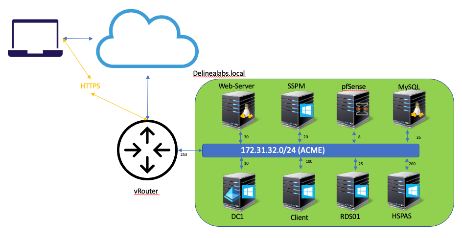

# Instructions for the Demo Guide

After downloading the demo ova images the following needs to be done to get the demo environment up and running:

1. Network layout
2. Network changes to be made if needed
3. Order of starting the VMs
4. Testing the environment before the demo

!!!Warning

    The environment has been created using the version that were current at the beginning of July 2023. any updates on agents and Applications may have to be performed to run the latest and greatest releases. 
## Requirements for the Demo Environment

The Demo Environment is created for ESXi 6.7 and up. The total environment exists out of nine VMs that will consume a total of 48 GB of RAM and 400 GB of storage.

## After importing the OVAs

When the OVAs have been imported into your environment, the MAC Addresses might have changed for the VMs. This will have some consequences with respect to the IP addresses in all VMs. The operating systems will "see" a new NIC and assign DHCP to the NICs automatically. The MAC Address column, the OVAs have been exported with **KEEP THE MAC ADDRESS** flag, can be used to "reset" the MAC Address to the MAC Address to the time the machines got their IP Addresses.

!!!Tip
    Besides the normal VMware and Windows drivers, the VirtIO drivers have also been installed in the Windows O/S based VMs to be able to import the OVAs in KVM based Hyper-Visors like Proxmox.

!!!warning
    When "resetting" the MAC to below table, make sure to reset the MAC **BEFORE** power-on the VM.

    Make sure to reinstall the Privilege Manager Agent and follow this article to have the Agent use the same UUID over and over again: https://docs.delinea.com/pmgr/current/agents/all/vm-deployments.md#multiple_vms_collapsed_to_a_single_resource. The Privilege Manager Agent uses the UUID of the VM to identify itself to the Privilege Manager application. Setting this to the UUID in the Application, y0u make sure that the agent will always have the correct UUID in the application.

## Network layout

The network that is being used in the demo environment is in the 172.31.32.0/24 subnet. To overcome any possible issues, this subnet needs to be available in the network. 

Below table shows the VMs, there function, IP addresses and their MAC Addresses at the time of creating the OVAs.

| VM name | Description | OS version |IP address | MAC Address |
| - | - | - | - | - |
| Web-Server Linux | NGINX Linux <BR> Redis database for Cloud tenant | Rocky Linux 9 | 172.31.32.30 | VMXNET3: 00:50:56:b7:f0:3e |
| MySQL Linux | MariaDB Linux | Rocky Linux 9 | 172.31.32.35 | VMXNET3: 00:50:56:b7:67:50 |
| Client | Client VM | Windows 10 | 172.31.32.100 | VMXNET3: 00:50:56:b7:9b:12 |
| DC | Domain Controller | Windows 2022 | 172.31.32.10 | VMXNET3: 00:50:56:b7:0f:05 |
| pfSense | pfSense router for some secrets demos| OpnSense 21.1 | 172.31.32.8 | VMXNET3: 00:50:56:b7:5b:66 <BR> E1000: 00:50:56:b7:5b:9c |
| RDS01 | RDS server for some secrets demos | Windows 2022 | 172.31.32.25 | VMXNET3: 00:50:56:b7:66:85 |
| SSPM | Secret Server and Privilege Manager installation <BR> Mail server for the delinealabs.local domain | Windows 2022 | 172.31.32.20 | VMXNET3: 00:50:56:b7:71:88 |
| vRouter | VyOS based router between the networks | VyOS 1.4 | 172.31.32.253 | VMXNET3: eth2 (LAN): 00:50:56:b7:4a:78 <BR> VMXNET3: eth3 (External): 00:50:56:b7:47:5d |
| HSPAS | Cloud tenant <BR> PostgresSQL Database for Cloud tenant | Windows 2019 | 172.31.32.200 | VMXNET3: 00:50:56:b7:d0:f0 |

As the vRouter is the routing device between the demo network and the LAN of the installation (172.31.32.253 is the default gateway on all VMs), this VM has two nics. One of them (LAN side) is using a DHCP defined NIC. Making it possible to route between then networks, it has Network MASQ enabled on this NIC. The pfSense also has two NICS, but is not used for routing. It can be set up to become the router and not the VyOS router, but that is out of scope of this instruction. Documentation can be found on the internet.

A graphical representation of the network is shown below:



Changes may be needed to get the routing working, if MASQ (NAT/PAT) is needed due to the fact that a static route can not be added to the LAN network, or the machine on which the demo is run. The next chapter describes what needs to be changed.

## Network changes to be made if needed

As this VyOS router is a very common virtual router, changes can be easily found on the internet. A good location would be:

- By default the deployment of OVAs will generate NEW MAC Addresses that need to be configured in the VyOS system. To do this run the following commands to:

    1. See if there are new Ethernet adapters
    2. Configure the new Ethernet adapters

### Configuration of the VyOS

To see the current ethernet adapters (others then eth0 and eth1), follow these steps:

1. Login to the VyOS VM using **vyos** and **Delinea/4u**
2. Run the following command ``show interfaces``. If you see eth2 and eth3 with no IP addresses, two new ethernet adapters have been configured and they need to be configured
3. Run the following sequence to configure the two new ethernet adapters:

    - ``conf``; enter the configuration mode
    - ``set interfaces ethernet eth2 address dhcp``; this is the interface that is connected to the internal DHCP network
    - ``set interfaces ethernet eth3 address 172.31.32.253/24``; this is the internal IP network of the VMs
    - ``commit``; command to commit the new configuration
    - ``save``; this command makes sure that the configuration is saved to disk
    - ``exit``; leave configuration mode
    - ``show interfaces``; the two new interfaces (eth2 and eth3) should now have IP addresses assigned to them if DHCP has been configured.

4. As the eth2 is set to use DHCP, routing has to be defined in the organization's network. This can be overcome by using masquerading the network. Run the following commands to get masqueing running (https://forum.vyos.io/t/resolved-port-forward-troubles/7732):

    - ``set nat source rule 100 outbound-interface 'eth2'``
    - ``set nat source rule 100 source address '172.31.32.0/24'``
    - ``set nat source rule 100 translation address 'masquerade'``

## Alternative to VyOS configuration

ReIP all VMs that exist in the demo environment to a more convenient range. This invokes a lot of steps that must be done:

1. ReIP all VMs, based on the O/S some are easier then others
2. Recreate the DNS records in the DC1 to correspond to the new IPs and range
3. Reconfigure the DNS server to use forwarders that are available to the system
4. Check all connectivity on Domain level before running the demo.

## Order of starting the VMs

The order of starting the VMs is important. If the order is not correct, some topics in the demo guide will not function as expected/described.

The ideal order is:

1. vRouter
2. Web-Server Linux
3. DC
4. HSPAS
5. SSPM
6. Client
7. RDS01
8. MySQL Linux server
9. pfSense

!!!tip
    VMs 1,2 and 3 can be started together. The HSPAS server is dependent on the Web-Server Linux as it holds the Redis database that is being used by the HSPAS server. Then wait till the DC is 100% running before starting other machines. As the SSPM server is the SQL server for the databases that are used in the ServerPAM solutions, this server has to be started after the DC. The Client, MUST be started BEFORE the RDS01 server but AFTER SSPM. Reason is that the Client holds the management component for the Delinea Server PAM. If this server gets started AFTER the RDS01, the login into the RDS01, will not work. The easiest way to solve this issue is to reboot the RDS01 so the Server PAM Agent cache will be cleaned and refilled.

!!!warning
    To login to the DC VM, it CAN ONLY be done via the console. A RDP session will not be allowed due to configuration of policies in Delinea Server PAM.

## Licenses

As the environment has no licenses in it, you have to inject the licenses in SSPM, for Secret Server and Privilege Manager and DC and DA licenses for Delinea Server PAM.
For injecting the license, follow these steps:

1. Delinea Secret Server and Privilege Manager - https://docs.delinea.com/secrets/current/setup/licensing/adding-activating-deleting-licenses/index.md
2. Delinea Server PAM: https://docs.centrify.com/Content/inst-lic/ManageLicensesIntro.htm

For the Windows Server Operating Systems, including RDS, follow the Licensing steps as described by Microsoft.

!!!tip
    If RDS licenses are not available in the organisation, follow these steps as described [here](https://www.virtualizationhowto.com/2020/10/reset-120-day-rds-grace-period-on-2016-and-2019/).

    DISCLAIMER: This is JUST for educational purpose, not to bypass Microsoft Licenses!!!
    

## Testing the environment before the demo

After the VMs have been started, run the demo guide as shown on https://workshop.thyintresources.com/demoguide/

Quick checks:

1. Can login as the user **afoster** on the RDS01 and get MFA challenges
2. Can login to the Secret Server UI from the Client.
3. Can login to all VMs using the mentioned username and password combination

!!!Warning
    
    In some cases the Privilege Manager Agent does not register itself. Revoke the current code in the Privilege Manager interface and have a new code. Reinstall the agent using the new code to reinstall the Privilege Manager Agent. 

### Username and passwords

| VM name/App | Username | Password |
| - | - | - | 
| MySQL Linux | root | Delinea/4u |
| Web-Server Linux | root | Delinea/4u |
| Client | DELINEALABS\afoster | Delinea/4u |
| DC1 | DELINEALABS\Administrator <BR> DELINEALABS\adm-training | Delinea/4u <BR> Delinea/4u |
| pfSense | root | Delinea/4u |
| RDS01 | DELINEALABS\afoster <BR> DELINEALABS\adm-training | Delinea/4u <BR> Delinea/4u |
| SSPM | adm-training <BR> admin | Delinea/4u <BR>  Delinea/4u!! |
| vRouter | vyos | Delinea/4u |
| HSPAS | Administrator | Delinea/4u |

!!!danger

    Please try to avoid logging into the HSPAS machine. It is needed as is distributed. The cloud tenant might not run as expected if changes are made.

## Delta deployments

This section is describing the steps to undertake for the new version of the Demo Environment


### Version 4.0.1.1 - 21st of August 2023
- Due to an update on the Rocky Linux machines, Heartbeat and RPC are not performed as expected. Run the below command and reboot the server to take effect 

    ``` bash
    update-crypto-policies --set LEGACY
    ```
  
### Version 4.0.1 - 21st of July 2023
- Update the Privilege Manager 11.4.1
- Follow article <https://docs.delinea.com/pmgr/current/agents/all/vm-deployments.md#multiple_vms_collapsed_to_a_single_resource> to have the agent always use a static UUID
- Update Secret Server to version 11.5.000002

### Version 4.0.0 - June 2023
- New domain and installation from scratch
- Exchanged CentOS for Rocky Linux 9.1
- Installed Current Privilege Manager
- Installed Secret Server
- Installed Server PAM
- Installed Redis Server
- Installed HSPAS