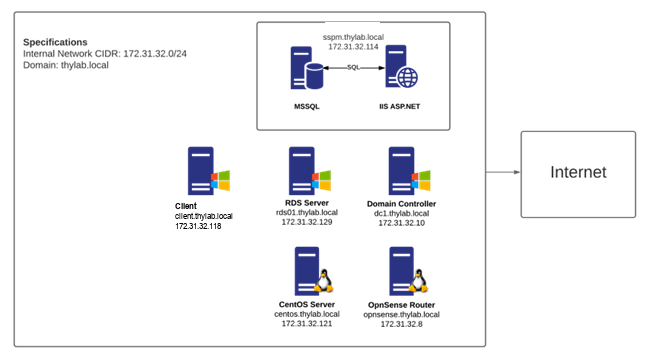

# Introduction

This lab guide is designed to be used alongside lab instances provided for Delinea Privilege Manager. These have all been configured for the appropriate personnel. The guide covers a number of different Privilege Access Management use cases, giving the user an overview of the solution's broad capabilities. 

!!! Note
    The components featured within the lab are fully pre-built, hence no software installation will be required within the lab.

The guide is designed to assist you to explore the varied functions available in the solution, but is not meant to be an authoritative guide to all functions available. Hence, feel free to explore the options available to you and don't hesitate to reach out to your Delinea liaison should an additional feature or function take your interest. 

## Solution Overview - Delinea Privilege Manager
Delinea Privilege Manager is an enterprise-grade Privilege Access Management (PAM) solution that is designed to allow organizations to streamline and control access to applications in a secure, effectively and rapidly manner. 

The solution is delivered either as a Cloud (SaaS) delivery model or in an on-premise format, giving customers large amounts of deployment flexibility. For on-premise, the solution leverages Microsoft standards (MSSQL database backend and IIS ASP.NET frontend) allowing customers to take leverage in-house Microsoft knowledge in establishing and managing the platform. High Availability and Disaster Recovery can be embedded into the solution at every layer, ensuring that the deployment is robust and highly available.

Authentication to the platform can be provided based on user identities in numerous directories, including Active Directory, Azure Active Directory, SAML and LDAPS. In addition, role-based access within the service can be managed through directory group membership, enabling organization-wide flexibility of access.

Applications can be controlled and even caught by using policies. These policies can be assigned to allow, with different effects. Elevation the application to an administrators level is part of the possibilities. Also blocking of unwanted, or even virus affected files can be blocked using policies. Workflow to allow certain users in the Enterprise to use and install applications, with a justification, also belongs to the possibilities.

Local group memberships, like the Local Administrator group, can be managed throughout the Enterprise environment using a relative simple process. This allows for closing back doors for people. THe other side affect this solution can deliver is to remove the need for Local Admin rights for the users closing loop holes in the current Always Connected World.

## Terminology

Throughout the guide, the Delinea Agent, the component that is to be installed on the client that needs to be managed, will be referred to as the Agent.

### High Level Architecture
The Privilege Manager installation in the lab is architected as follows. 

Deep knowledge of the instance architecture will not be a pre-requisite for completing the Use Cases within this guide, as the PAM solution itself handles the networking required for maintaing and deploying the pre-defined policies.

#### Components

**Privilege Manager (Application)**
This is the Privilege Manager server which houses the frontend IIS ASP.NET web application server and the backend Microsoft SQL database server (single database) which powers the solution.

**Domain Controller**
The lab has it's own Active Directory domain (thylab.local) for which there is a single Domain Controller. The domain includes various test user accounts with varying levels of privilege, in addition to standard Active Directory Security Groups that can be used to determine user access levels within the solution.

**Client**
This Window 10 machine acts as the client to which the policies will be deployed and tested. Delinea recommends to have a testing environment available when building the policies as a wrong policy can drive users to madness as they will get pop up message on every single application or process that is started by then AND the system.

**RDS Server**
WILL NOT BE USED in this part of the lab

**CentOS Server**
WILL NOT BE USED in this part of the lab

**Virtual Router and vRouter**
WILL NOT BE USED in this part of the lab
