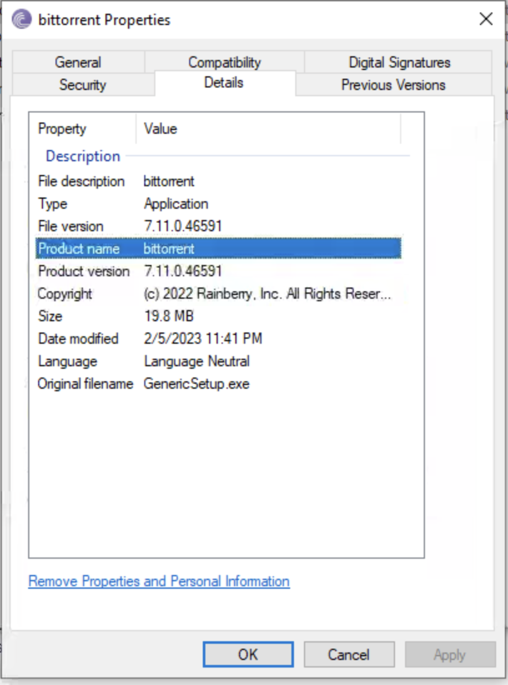
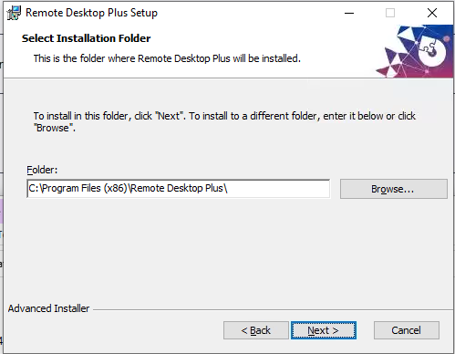
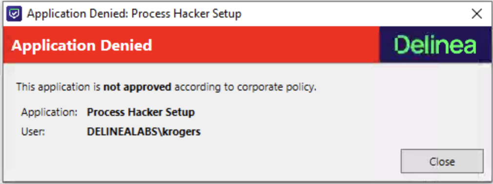
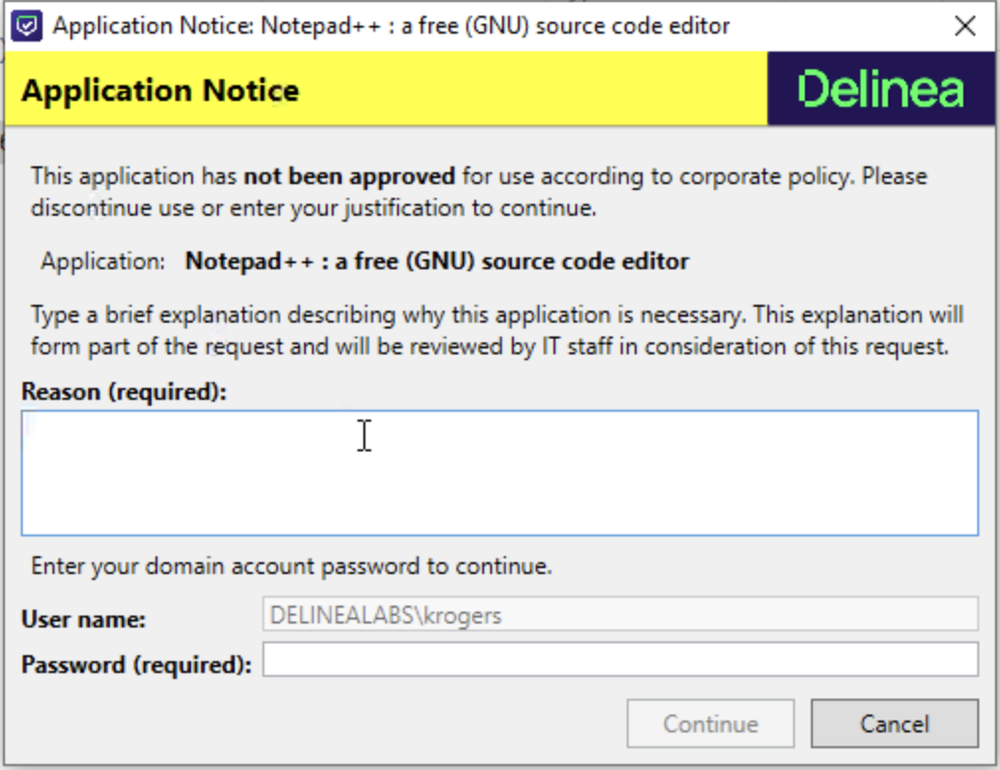

# Application control use cases

We will assume that your lab is already switched on. If not, you'll need to press play and wait at least ten (10) minutes until the lab is ready for use.

The first, tentative step you're going to need to take into the lab is to authenticate with the **Client** machine as a standard Active Directory user. Fortunately, SkyTap makes this easy for us.

Click on the **Client** to get started and a new tab should open, and you'll be presented with a Windows logon screen. 

 

Log in to the device with the **krogers** user by pressing the arrow down at the top of the screen and click **CTRL-ALT-DEL**. Then insert the password into the password dialog box using the insert button by using the Keys icon in the top of the screen.

 

With any luck, you'll now be in! 

## Block

One of the oldest application which is in almost every installation of Microsoft is Internet Explorer. Since June the 15th 2022, Microsoft has stopped the support for IE (https://docs.microsoft.com/en-us/lifecycle/faq/internet-explorer-microsoft-edge) and encourages all organisations to switch to Microsoft Edge as the new browser. Problem is that many organisations still have IE installed on their machines as Microsoft has it preinstalled on their versions of Windows, and it is very hard to deinstall the application on scale, let alone maintaining the script do to exactly that due to changes that will happen. There is easier way by just leaving it at the machines, but create a policy that will block any use of the application till an upgrade of the machines has taken out the IE installations.

To set such a policy, we want to gain access to Privilege Manager itself. For that, we are going to need Google Chrome, so go ahead and fire it up and head to: **https://sspm.delinealabs.local/TMS**. You should then be presented with the login panel. If not, panic... just kidding. Speak with your Delinea representative for further instruction if the login panel just doesn't appear.

Click the **Default NTLM Authentication** and provide for the login the user **krogers** in the **delinealabs Domain**, the credentials are available using the insert password by clicking the Keys icon in the top screen Skytap bar as you did before.

This will open the UI for Privilege Manager.

Now that you see the Dashboard, head over to **Windows Computers > Application Policies** and open the **Block Internet Explorer** policy. In the next screen you will see the settings. The below is providing a short summary of the most important settings.

### Policy Details
This part of the policy is providing some information of the policy like to which computer the policy is to be send/deployed, If it is deployed (only when activated (toggle switch at the top)), last modify date and time and the priority of the policy.

#### Policy Priority
Privilege Manager uses this field to run the policy in batch order. The lower this number the higher the priority of the policy. This means that the order of policies WILL have an influence on the user experience. Recommended is to have BLOCK policies the lowest number so it gets "executed" first before moving forward. A side effect is that when there is a block and an elevated policy, starting that in a later stage of the lab, can have a negative influence on the yes/no execution of an application. Example, let's say that in some case an application should not be run unless a certain situation. In all other situations the application should be block. If the block is AFTER the elevate policy, the block policy may NOT be executed and the application is run with elevated rights.

### Conditions
Under condition, we can use filters for applications and other extra filters we want to have to narrow the situations as much as we can, without loosing the scalability of policies. We can make a filter for one specific user, but that is not really scalable, especially if we have 1000+ users. So we want to make sure we can use group memberships, or as general as possible. The extra filters (inclusion and exclusion) can have multiple settings.

#### Inclusions filter
This filter will only be true if ALL set filters are matched, so comparable to a logical AND function. If one of them is FALSE, the Inclusions filter will not be matched.

#### Exclusions filter
This filter is using a logical OR function, and can also contain multiple filters. As soon as one of these filters match, the Exclusions will return TRUE. An example would be to exclude all Administrator accounts from the policy so they can run their tasks without a policy, like a block, intervening.

### Actions
This part of the policy is defining what the actions will be if conditions are met. These can be multiple actions as well. This is not just on parent processes, but also on child processes. An example of this would be a MMC.exe starting a *.msc file. Another exemple would be, an elevated cmd session starting regedit. 

One toggle in this area is important to understand, the **Log Policy Events** switch. By enabling this switch all events that are met with this policy are going to be logged. Be careful as this may overload the system easy as in a big environment with many machines/agents, those event will be pushed by the agents to the server that needs to index and track them. Use wisely!!!

### Run the policy
Make no changes yet to the policy! Open the start menu on the client, type **iexplore** and run Internet Explorer

The application will open as it normally would. As we want to avoid this, close Internet Explorer and return to Privilege Manager UI. Toggle the switch in the top right corner of the policy so it reads **Active**

As the policy is now active on the server, we can do two things. 1) wait for 5 minutes for the agent to pull the latest policies, or 2) force the update by using the Agent Utility that comes with the installation of the agent. We are not going to wait and use the second option. Start the Agent Utility (the second icon to the right besides the Menu icon) and click the **Update** button.

This will show that there is a policy activated in Green text

Now retry to run iexplore and you will get a **Application Denied** message. Even if you try to run it with elevated rights!

Click **Close** to close the message. Now that the block for IExplore is ready, let's look at the other Block policy in the Privilege manager UI, called **RED - Block Bittorrent executables**

This policy is blocking the usage of BitTorrent as an application. Activate the policy and update the Agent using the Agent Utility. After that has been realized, open on the desktop the folder **Installation Files**. There will be a **bittorrent.exe** file and try to run it. A Windows related error will appear and also there will be a message in the right bottom corner sliding in that bittorrent.exe has been stopped from executing. 

Click the **OK** button to close the error screen. Try to bypass this policy by renaming the file to something randomly. No matter what you do with the name of the file, it is still blocked from executing. Reason for this is that the underlying policy filter is looking at the Product name the file. To see this, right click the file you just changed, **Properties** and click the **Details** tab. There you see the Product name as **bittorrent**.

The Product name can be changed, but it will change the sha key Privilege Manager uses, and may trigger other filters and policies. So running not allowed applications becomes hard for users. 

Now that we have the blocked application done, let's go to the next use case. Allow applications, but only when an approval has been given.

## Approval workflow
Let's see what we can do with the Approval process for applications. And how that works for users and their experiences. In the Privilege Manager UI, activate the **AMBER - TeamViewer install and usage requires approval** policy and update the Agent.

The agent will show the green text that a policy has been activated. Back in the **Installation Files** folder on your Desktop, run the **TeamViewer_Setup_x64.exe** and see what happens. Shortly after you started the installer a new message popped up in which a reason has to be provided. 

After the reason has been given a approval process starts. Return to the Privilege Manager UI and click the **Dashboard** by clicking on the top item (Privilege Manager). There you will see a **Pending Approval Request**.

Click the **Approve** button and the message will change to Approved, and the Continue button will be active.

Continue the installation as the end has no value for now. What did you noticed??

!!! Note
    Due to the policy settings the installation has been run using elevated rights. So no UAC screen has been shown, even thought the user is NOT in the Local Administrators group, or have administrative rights!!!

---

## Justify

Let's see what we can do with the Justify process for applications. And how that works for users and their experiences. In the Privilege Manager UI, activate the **YELLOW - RemotePlus installer** policy and update the Agent.

The agent will show the green text that a policy has been activated. Back in the **Installation Files** folder on your Desktop, run the **RemoteDesktopPlus.msi** file and see what happens. Shortly after you started the installer a new message popped up in which a reason has to be provided. 

Click **Continue** and the installer will just run, BUT with elevated rights. There will not be any UAC screen where the user needs to type in the credentials for an Administrative account.

## Elevate
The last part is to have the possibility to just run with elevated rights if the application is allowed, white listed. Activate the **WHTITE - Allow Putty installer version 0.78** policy and update the agent again.

The agent will show the green text that a policy has been activated. Back in the **Installation Files** folder on your Desktop, run the **putty-64bit-0.78-installer.msi** file and see what happens. Nothing else but a normal installation should happen with Elevated Rights so Putty could be installed. 

## Virus reputation driven
What if your organisation is more open and kinda allows everything, but not that users have local admin rights? That is hard to do right? Well, no, what if there is a possibility to run/install applications based on a Virus Reputation from VirusTotal? 

Back in the Privilege Manager UI, head to **Windows Computers -> Application Policies** and activate the two policies with Virus Reputation in the name, and update the agent again.

The agent will mention that two new policies have been activated. 

Head to your Download directory and run the two files you see there. On one of the files you will get an Application Denied! The reason is simple. **processhacker.exe** is seen by VirusTotal as **BAD** and therefore not allowed to be run. Click **Close** to close the message box.

Now try to run **npp.8.4.4.Installer.x64.exe**. You will see that it doesn't have the issue and is allowed to be installed after you have given the reason why you needed that installer to run and you need to provide the account's password, so the system knows it is the correct user (kind of MFA).

Continue the installer of Notepad++

## Monitor
For some situations, there may not be any policy available on applications that the IT department is aware of. Using an awareness net to create a list of software that is run by a user, but due to limitations of not having administrative permissions can not be run, or has no policy assigned. Using a so called **Catch All** policy these situations can be tackled.

Scroll all the way down in the Privilege Manager UI under **Computer Groups -> Windows Computers -> Application Policies** and open the **Catch All Policy.** All the way to the bottom you will see that the **Log Policy Events** is enabled so we can see the applications that were matched against no other policy. Head to **Policy Events** in the left hand Navigation Bar and see which applications where matched with no other policy then this one and how often.

Another example is to add a Catch All policy that is triggered when the UAC is opened so applications that are run and NEED administrative privileges can be caught and remediation action can be taken.

## Allow certain Windows settings

Some settings for Windows computer can be given the rights to users even though they have not local admin rights. Try to run the defragmentation of the C: drive and see that the UAC is needed to run the **Analyse** stage (**File Explorer -> This PC -> Right click Local Disk (C:) -> Properties -> Tools -> Optimise**)

Close the defragmentation screen. Back in the Privilege Manager UI, head to **Client System Settings** in the left navigation pane, and enable the **Defragment the Disk** setting and update the Agent.

Try to rerun the defragmentation and see that the Analyse button has changed to a normal button (no UAC shield is shown). 

This is just one of the possible options you can allow system settings. 

### Remove Application
What about deinstallation of applications? This is something you MUST have the local admin rights for. Well..... Yes, but there is a policy in Privilege Manager that we can use to provide access to a tool that is capable of de-installation of applications, even thought the user is not part of the Local Admin group, or has been given the rights.
In the Privilege Manager UI, head to **Windows Computers > Application Policies** and activate the **Elevate Privilege Manager Remove Programs Utility Children Policy (Sample)** policy.

Update the Agent again and run **C:\Program Files\Thycotic\Agents\Agent\Remove Programs Utility**

Search **Notepad++ (64-bit X64)** and click the *Uninstall* button. This will trigger a message where an approval process will be triggered. Provide a message and click **Continue**. Approve the request in Privilege Manager. When asked remove all settings from the application.   
Repeat this process for **TeamViewer** (all components) and **RemoteDesktopPlus** . You may have to refresh the browser to see the approval request. Leave all other applications as they are as we might need them further in this lab.

