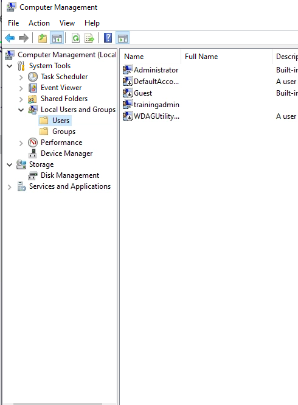
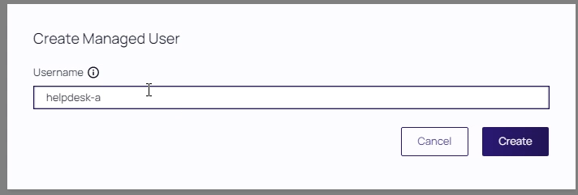
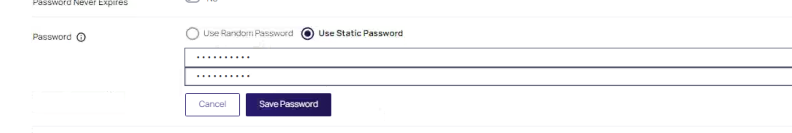
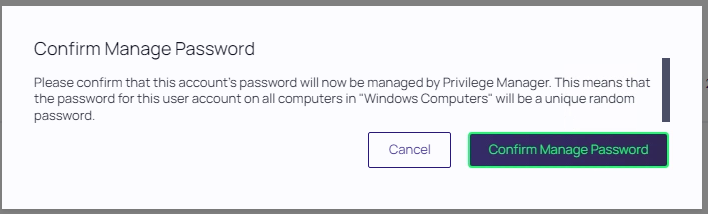
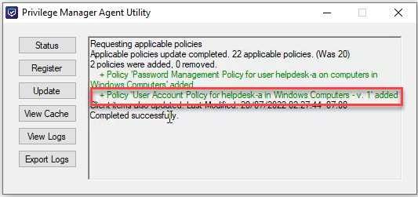
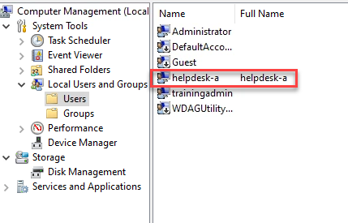
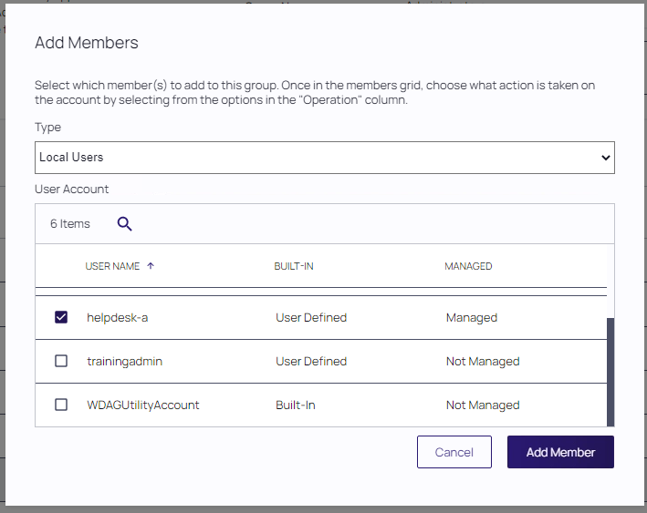
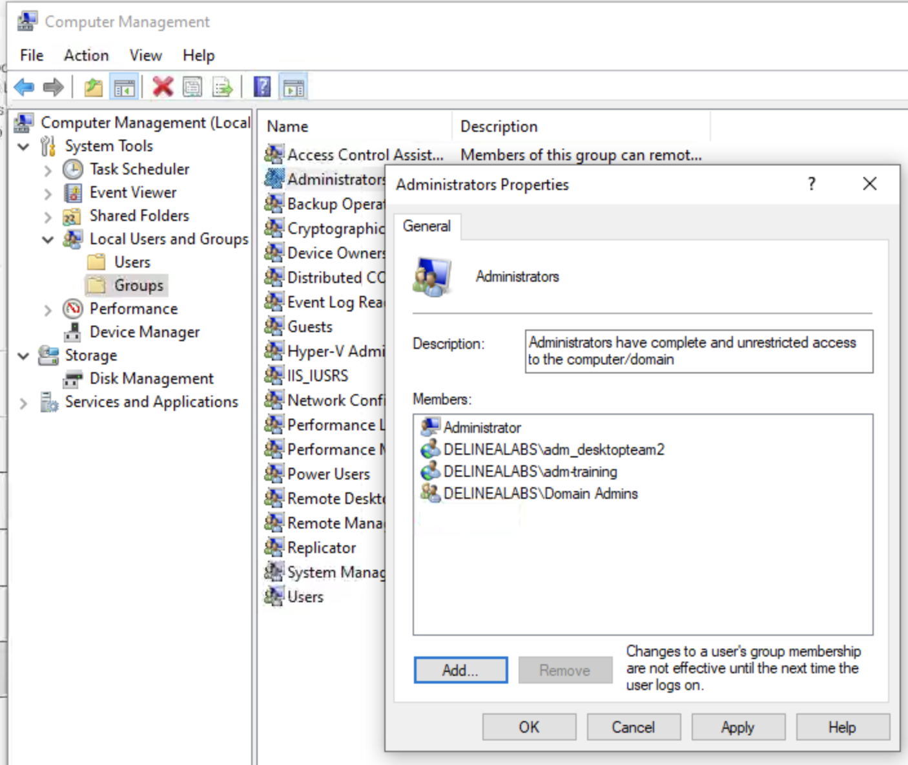
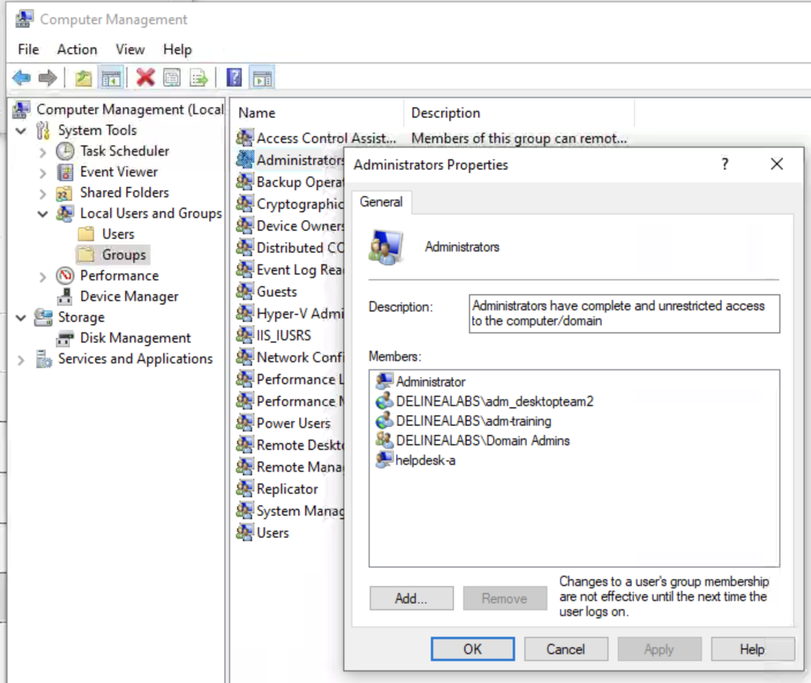

# Local user/group Management use case

One of the most difficult things that needs to be controlled are the local users and groups on Windows machines. It can be scripted, but the triggers to run scripts is hard to maintain when the machines may and may not be connected the the corporate network. Still this is the biggest headache for a lot of organisations in the world.

This lab is showing how Privilege Manager can help in managing those Windows machines from a policy perspective.
## Local User
One thing a lot of organisations will have is a specific local admin user. In case of issues the helpdesk, or IT admins, can use that account to login to the systems remotely to help people on their issues. This account, as it is very powerful, needs to be protected and available at all Times. To make this happen this lab is going to show how this account can be pushed into the machines, on which the Privilege Manager Agent has been installed.

On your client click the **Start Menu** and type **Computer Management** and start the application. Even though the logged in user is a normal user, the applications starts. Navigate to **System Tools > Local Users and Groups > Users** and see that there is no **helpdesk-a** user (the account the helpdesk/IT people use for remote issues).

In the Privilege Manager UI, head to **Windows Computers > User Management** and click **Create User** in the top right corner. Provide the name **helpdesk-a** as the username and click **Create**

In the new screen, toggle the **User Managed** switch to **Yes** and provide a password (twice) in the *Initial Password* field by clicking the text **Edit** and click **Save Password**

Click **Save Changes**. Click the **Account Password** tab and switch the toggle to **Yes** on the *Password Managed* Line. Click **Confirm Manage Password** on the screen that appears.

Leave all settings default and click **Save Changes** to save all.

Using the *Agent Utility*, update the configuration of the agent on the client machine. This will show two green lines meaning the agent has added two Policies to the system. One of the lines is showing that it has added an account helpdesk-a to the system.

Return to the *Computer Management* screen and refresh the screen. Now you will see that the **helpdesk-a** account has been created. 

Close this application as we need to open it again, but now as an Administrator. Click the Start Menu and open Computer Management again, but now Run as Administrator. As we have no specific rules against this, the *VirusTotal reputation based policy - WHITE* will be run and you have to authenticate to run the Computer Management application. 

After you have provided a reason and authenticated yourself, the application will open. Navigate back to **System Tools > Local Users and Groups > Users** and delete the *helpdesk-a* account. This will be allowed, **BUT** as soon as you do a refresh, it reappears. 

This is the agent that is running. It runs a remediation task as that is what the policy told it must do. The helpdesk-a account is "protected" by the Agent. It will make sure that account always exists. Even when the machine is offline. Leave the Computer Management open as we will be using it shortly. 

Now that we have a "protected" account, we need to make sure that the account is always in the Local Admin group of the machine.

## Local Admin Group

Back in the Privilege Manager UI, navigate to **Windows Computer > Group Management** and click the **Administrators** group. In the line **Manage Group** toggle the switch to **Yes**. Click the **Add Member** button and select **Local Users** and select the **helpdesk-a** account by checking the box in front of it and click **Add Member**

Back in the main screen, set the **Operations** column as shown in the below screenshot

Click **Save Changes** and **Yes** to confirm the save. Back in the Computer Management applicaiton, open the Local Groups and click the Administrators group and see that the accounts **Administrator, THYLAB\adm_admin2, THYLAB\adm_training and THYLAB\Domain Admins** are mentioned.

Update the configuration by using the **Update** button in the Agent Utility to grab the latest polices. A green line should be mentioned and that something has been added to the System. In Computer Management, reopen the Administrators group and see that the helpdesk-a account has been added.

Now try two things and see what will happen: 

1. Try to delete the helpdesk-a account from the Administrators group
2. Try to add your account (THYLAB\user) to the group so you can create a backdoor

The outcome for both the actions should be the same, it is allowed, but as soon as you refresh the screens, it will have been remediated to the set policy.

## Conclusion

Using Privilege Manager it is relatively easy to control the local accounts AND local groups using a policy based mechanism on machines after they have been added to privilege Manager using an Agent.

   