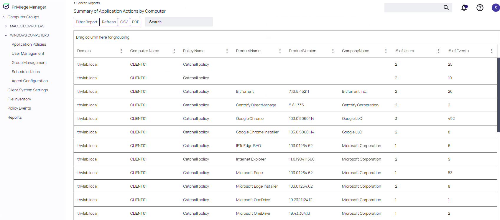
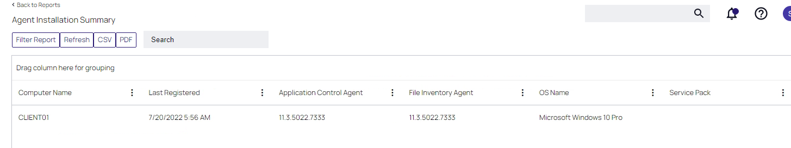
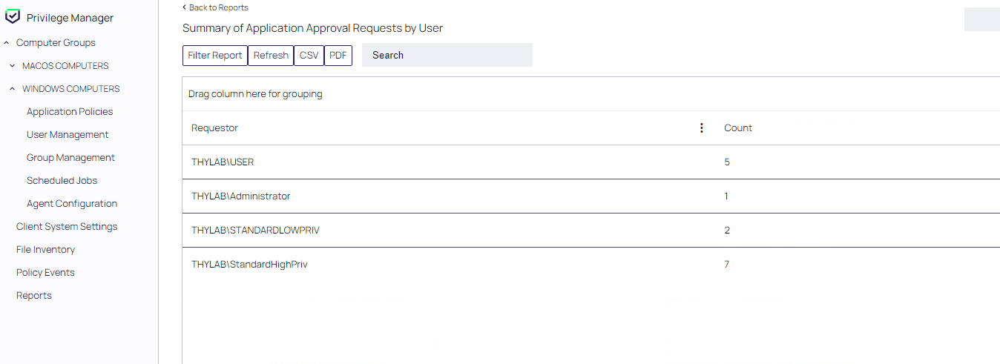
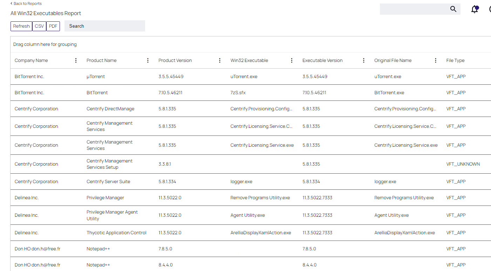
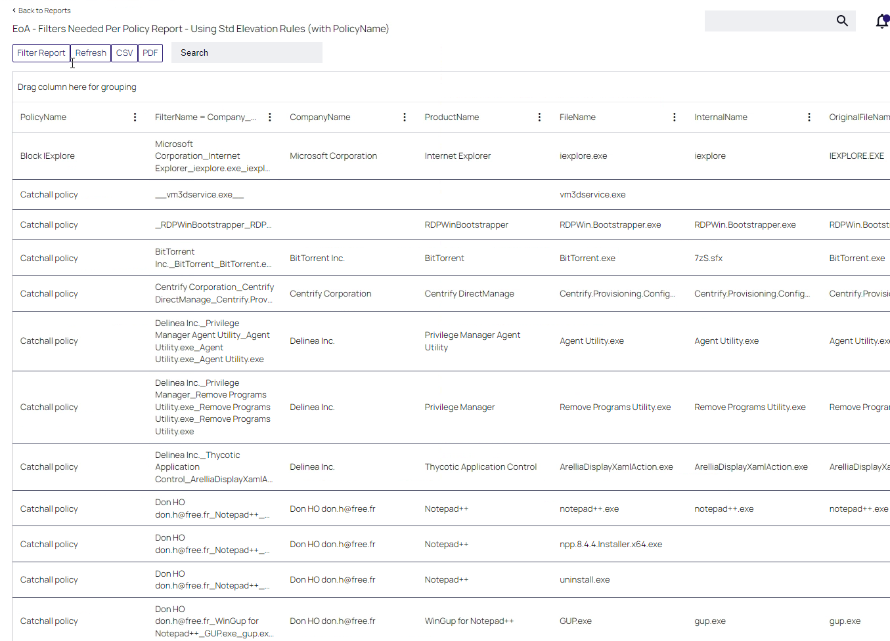
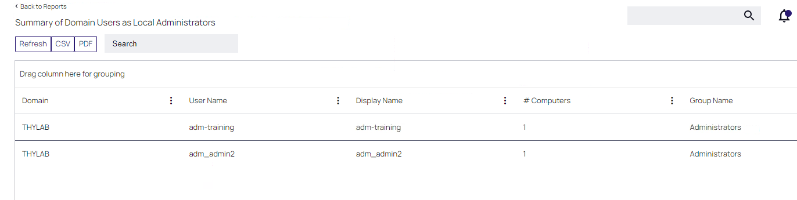
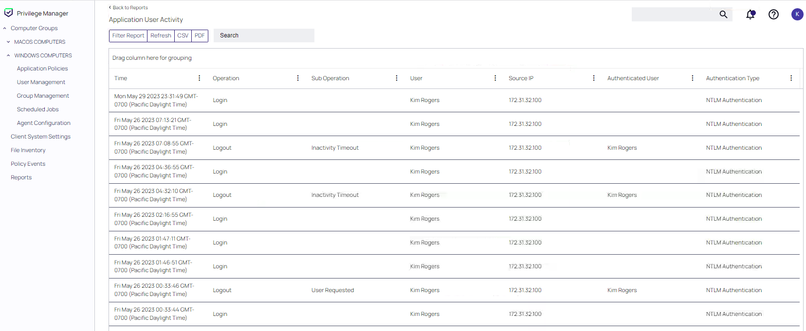

# Reporting use cases

Reporting is an important part of Security. Who has done what and why is always the question that is raised in the context of security and laptops. "Which applications are falling through the mazes of the policy net and why?", are some questions the IT and Security teams are asking themselves. Privilege Managers comes with approx. 100+ reports out of the box (OOTB). These reports can be disabled, so they can not be viewed. This declutters the UI to only showing those reports that can be used by the people.

## General reports information

The OOTB reports are bound together based on categories. The categories are:

1. Actions
2. Agent
3. Approvals
4. Detection
5. Diagnostic
6. Directory Services
7. Ease of Administration
8. Local Security
9. Security

The next paragraphs will discuss the topics one by one. After you have ran a report, the data can be exported into CSV and PDF for later steps in an analysis.

## Actions
This part of the reports page is providing information on Actions that have been done by users and can be run to see what happened on particular machines (Summary of Application Actions by Computer)

## Agent
This part of the reports UI is useful to see which machines have which version of the agent installed, and makes it possible to identify the old versions of the agents that need to be updated as example (Agent Installation Summary). 

## Approvals

Who's done what and why in the context of approval, can be found in this section. From the point of view of the approver as well as from the point of view of the user. Who has approved the most requests and which user has requested the most approvals. The why is something that needs to be analysed further to understand the reasons for example why user X has requested the most approvals. Did he/she have to many restriction to do their job? Is the person trying to run/install, too much software, even those she/he is not allowed to run?

## Detection

In this section, a very useful report might be the **All Win32 Executables Report**. This report can be used to track down software which is not licensed by the organisation. Is the software a pirated version where the user downloaded and installed it with a hacked key? Has the software been "hijacked" by a virus? What is happening in the machine with this software. Pirated/Hijacked software is the main reasons for viruses to enter systems and can be seen as the major root cause of infected machines.

## Diagnostic

The Diagnostic section can be used as example to see which agent has not received the policies it should have received. This makes it possible to start troubleshooting at the source and see why a particular machine is not behaving as it should. This might be because it misses the policy that is defined to overcome an issue, like running an application or installation with elevated rights.

## Directory Services
The Directory Services Section can create reports which can be useful to see the number of computer in each Organisational Unit in the AD that are under control of Privilege Manager.

## Ease of Administration
The reports in this section can be used to see relatively quickly which applications have been run using a elevation rule. So which application has been run that needed the Elevation action. This can be useful to see if the policy has been defined correctly. It may be that an application has been given the elevate right, where that should not be done.

## Local Security
The Local security reports are about the local user and groups on the machines that have been "connected" to the Privilege Manager. An example is the report that is called **Summary of Domain Users as Local Administrators** report. In this report you can see which AD users have local administrative rights, besides Administrator, on the machine. This could become useful when a user on a machine seems to able to bypass policies and runs whatever they want on the machine. This report can than be used to find the user that is having the wrong privileges.

## Security

This last section is all about who logged in to the Privilege Manager and from where. Also the Log out event will be shown.

