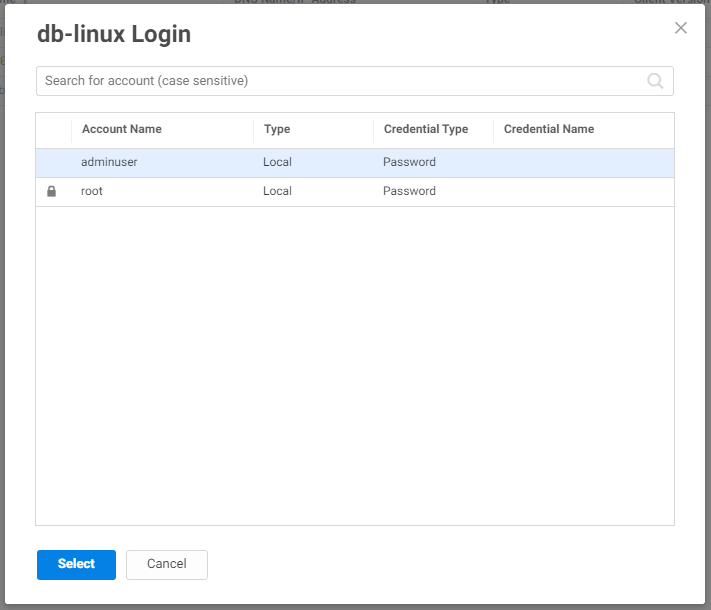
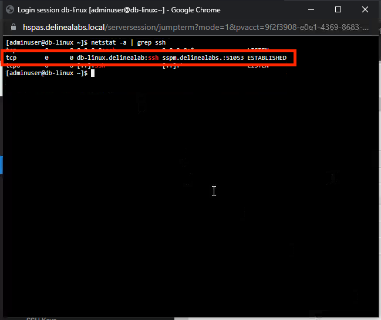
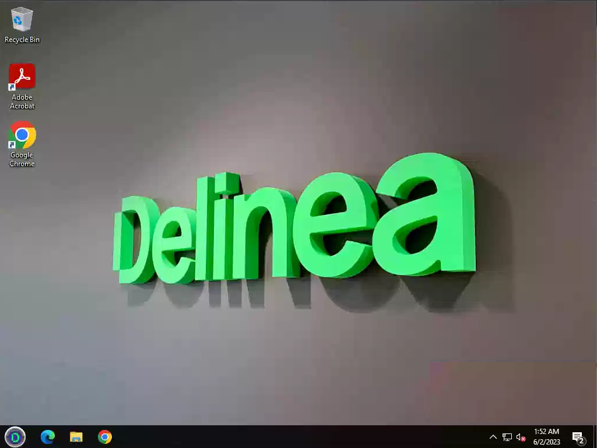
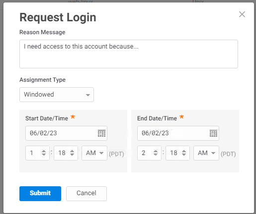
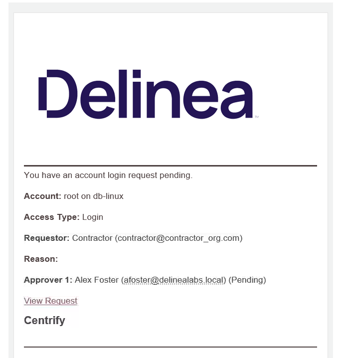
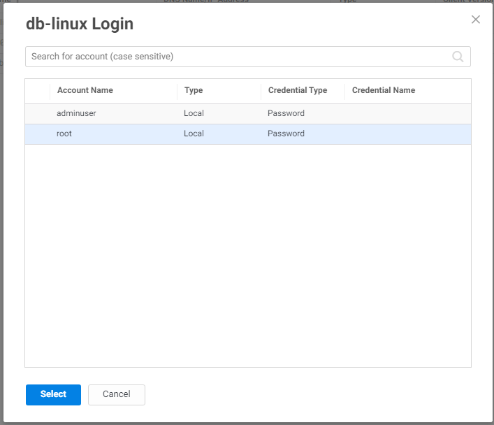

# Remote Access Services (RAS)

One of the most interesting solutions in Delinea's portfolio, is to provide a way for customers to have IT personal as well as third party contractors to log into a system without the need of a VPN connection.

VPNs are providing a great way to provide access to resources inside the DC of a customer, but imposes a few big risks:

1. A VPN can allow the user that is able to login, to see all network devices. Even the ones that he/she shouldn't see. Setting up ACLs are not an easy task to maintain due too the role of the person
2. Extra resources are needed and will put extra efforts on IT personal to maintain it
3. Opening of firewall ports so people can connect to the environment
4. Account management for the people that need to be able to use VPN
5. No 100% control on the machine of the contractor with respect to security, unless a laptop/machine under control of the customers is been lent.

## How does Delinea's RAS solution help?

One of the main differences is that Delinea's RAS solution doesn't need to have firewall ports being opened. All communications are outbound vai the Cloud Tenant that forms the heart of the connection path for all people that need to have access. The other part of the solution is that it is all HTML5 based and can work with all browsers that support this protocol.

This means that no matter what the O/S and state of the machine (on which the user initiated the connection) is, it will not be able to inject any malware like into the network as the machine will not have ANY connection directly with the target. All communication will be flowing through the Cloud Tenant and its Cloud Connector. This also has the advantage that where and what the environment is,on-prem or cloud based, as long as there is a network connection between these two major components, the principles are 100% the same. The cloud connector is the starting point for the last jump to the target and is 100% under control of the customer and can therefore be seen as a clean source.

Policies define what the user can see and at which levels MFA challenges, but also which and what type of challenges (Password, OAUTH, Security Questions, etc.) are triggered. The MFA challenge can be set at:

1. Logging into the cloud tenant
2. Logging into the targeted system
3. Running privileged elevated commands

The usage of credentials to be able to login is in the RAS solution solved by providing access to the integrated Secret Server solution. Using this solution in Delinea's portfolio, the to be used account's password doesn't have to be exchanged via email, or by other means. The Secret Server solution and its task stay 100%. No change is needed to be integrated. Rights have to be assigned to the personal so their secrets can be used. Password never have to be shown as they will be injected on the connection being made.   
Using a workflow on the usage of accounts, it is even possible to become as customer aware that personal is requesting the usage of accounts.

## Simulate contractor login to target

Back on the Client VM, close all open windows and start **Firefox** and open the URL of *https://win-platform.delinealabs.local*.   
When you have started Firefox there is a great change it is shown as one of the tiles.

!!!note
    We are using in this demo a VERY specific version of the cloud tenant. This version, as it is installed now, is not recommended in production environments. For demo purposes, it does function as intended.

Login as **contractor@demo.lab** and click **Next**

Use the password **Delinea/4u** and select one of the options mentioned in the Authentication Method.

!!!info
    The following are the answers to the MFA challenge:

    1. What is your favorite city?: Rome
    2. What is your favorite car brand?: BMW
    3. What is your favorite color?: Red
    4. Color?: Red
    5. Email challenge will go the email user@delinealabs.local. Open the MS Mail app and click the link **Continue..** or copy the numerical code mentioned

Click **Next** and answer the MFA challenge you have selected. 

### Start a ssh session

After you have been logged into the cloud tenant, navigate to **Resources** and see that there are two systems shown.

Right click the Centos and select **Select/Request Account**

Provide a justification for the usage of the account and click **continue**

Click the shown **thycotic** account and click **Select**

Provide the answers to the MFA Challenges and wait till the ssh session in HTML5 browser is shown.

In the session run the command ``netstat -a | grep ssh`` and see that the ssh session that has been built via the SSPM (Secret Server machine).

This means that your Client machine, even though in the same network, is NOT the stating point for the connection to the CentOS machine.

Close the connection to the CentOS by using the ``exit`` command or **<CTRL+D\>** and click **Close**

### Start a RDP session

Right click the *rds01.delinealabs.local* and select **Select/Request Account**, and provide a justification. In the next screen select the *delinealabs\landrews* and click **Select**

There is MFA from the cloud tenant. Answer the challenge and see that the RDP session is started. The user has no extra rights, and is created to have just the access to the system, BUT the system has a hidden gem configured...

Click the up pointing arrow next to the network icon and right click the D logo

!!!note
    Wait a few seconds before clicking the D as it will take some time. Best is to click when extra pop ups appear, like **Setup Offline NFA Profile**. 

Click the **New Desktop..** and select in the new screen **Desktop as Domain Admin** and click **OK**. The desktop session has changed into a session win which you have administrator rights.

Try to see the security tab in the Eventviewer (click **D (Start Menu location) -> Run -> evntvwr**) and see that the security information is shown

Logoff by clicking the **D** again and select **Log off** and click **Close** to close the session

### Use an account with workflow

Now that we see that the connection can be made in a secure manner, return to **Resources -> Systems** and right click **fin-rtr.delinealabs.local** and provide a justification. In the next screen click the vyos account and see that there is a small lock in front of it.

Click **Select** and see that a time window pops up and the reason why the account is needed.

Click **Submit** to submit the request

Open the MS Mail app and see that there is an email with the Subject **Account access request**. 

Open the email and click the **View Request** which will open a Chrome session with the request shown that will provide more detailed information.

Click **Approve** and see that you can change the timing for allowing the request. For now leave it default, as requested and click **Submit**

This will have triggered a new email that the request has been approved.

!!!info
    The contractor has been setup as an alias to the user@delinealabs.local mailbox and therefore both email messages will be routed to the mailbox of user@delinealabs.local. This will not be the same in a production environment. It has only been setup for this lab

!!!warning
    Don't click any links that are in the email, as it will ead to errors.

Now repeat the connection for the fin-rtr.delinealabs.local and at the point where you can select the account, notice that the lock has now been removed. Your request for access has been approved.

Select the account and click **Select** and work your way through the MFA challenge you face. This will end in a ssh connection to the router

Close all open windows. Including the SSH session you just opened.