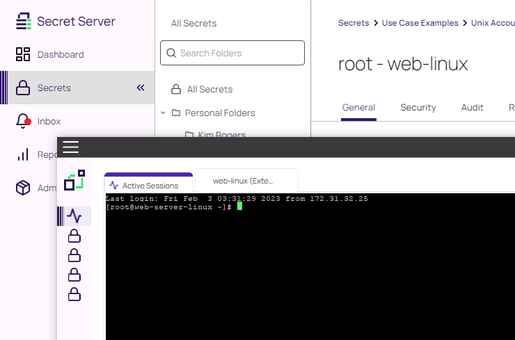
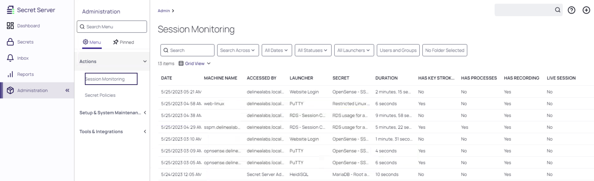

# Privilege Launching Use Cases

Privilege Session launching is a key component of the PAM solution, allowing administrators to get access to privilege without being exposed to the underlying credentials used therefore. This allows organizations to keep strict access controls in place, particularly when there is a requirement to give access to third-parties or internal users that are "less trusted".

## RDP

Still being logged into Secret Server as **KRogers**, open an existing session, or login as KRogers to proceed with the next chapters.
### Standard Launching

An important component of any PAM platform is allowing users to utilize privilege without having direct access to the underlying credentials. Head to **Secrets >> -> Use Case Examples -> Windows Accounts -> Domain Administrators -> Domain Administrator**. Within this Secret you will find an Active Directory account that is the domain administrator for the delinealabs.local domain. Note that the password field on the Secret is completely hidden and cannot be access.
 

However, scroll down and you will find that there is an RDP Launcher available, which will allow you to connect via RDP to a target host using this account and the privileges associated with it. Click the RDP Launcher button..

In the dialog box that is presented, enter "sspm.delinealabs.local" and hit launch now. 

A session will open in to the sspm server and you will be logged in as **delinealabs\administrator** by Secret Server. Nice, you've successfully completed your first privileged session launch!

!!!NOTE
    As the client has Delinea's Connection Manager installed, all sessions will be opened in this UI which makes it possible to have the One-Pane-Off-Glass for all open sessions that you may run from Secret Server. Connection Manager can also integrate with Secret Server so sessions can be started from within Connection Manager without the need to switch between UIs. We will discuss Connection Manager later.

### Session Connector Launching
The basic RDP launch establishes an RDP connection from your client device to the target host/platform using the privileged credentials. However, there are cases when you may want to launch using an intermediary device - commonly referred to as a "jumphost". The jumphost in Secret Server is referred to as Session Connector when RDP is in play.

Head to **Secrets >> -> Use Case Examples -> Windows Accounts -> RDS - Usage -> RDS usage for adm_desktopteam1**.

Go ahead and try launching the **RDS - Session Connector** option and at the prompt enter **sspm.delinealabs.local** and click **Launch Now**. This will download a RDP file you can open. If you open this a new screen will appear. Clicking on the details, lower left corner, you can see that there is a new session being started for a specific user. This user is created as a temporary user.

When the connection screen appear, click **Connect**

!!! Note
    To see that the connection is not made directly from your client, on the SSPM, open a command line and type ``netstat -a | findstr 3389`` and see that the IP addresses mentioned are not showing the name, or IP address of the client (172.31.32.100). You do however see the rds01 is mentioned, as that is the "jumpbox" for the connection

    

Close the session and you'll return to the secret. On this secret you can see that we have a number of different launching options that look similar to the standard launching function, however the actual launch itself will be run as a RemoteApp. This means that on your client it will look and feel the same as if you had opened the, however the actual application itself is actually running on the Session Connector host (it's a virtualized app). 

As example, Launch **RDS - Session Connector PowerShell** and after the session is active, run the command ``hostname``. Do the same on the client, open PowerShell via the **Start Menu** and see that the result is different.

### Additional RDP Launching Options 

There are a multitude of different options available for RDP session launching that helps ensure that users are getting the correct privileged access at the correct time.

In the example below (**Secrets >> -> Use Case Examples -> Windows Accounts -> Domain Administrators -> Hidden Details**), all of the fields are hidden and only the audit is shown. This is to prevent data leakage - particularly in the case of third parties - but ensures that they can still utilize the privilege that they need to in performing their role. 

To launch these category of secrets, back in the overview page, when you see three secrets, hoovering over the **Hidden details** secret a launch button in the form of a rocket is provided. Clicking this rocket will start the assigned Launcher to the secret. In this case the RDP launcher.

As well as having an open dialog box in to which the user can specify the device they wish to access, a device list can also be presented to the user that allows them to select where to launch to. Take a look at this in: **Secrets >> > Use Case Examples -> Windows Accounts -> Domain Administrators -> Restricted server for Domain Admin** and click the **RDP Launcher** to see an example of a restricted list of targets

!!! Note
    In some cases the device list is going to include a large number of items. If the list goes over 15 items, it stops displaying as a single list and becomes a searchable list, easing the user interaction with the tool.

Within each Secret there also exists a "Security" tab, under which you can easily - via checkboxes - make changes to the way in which the Secret is secured. For example, a comment can be required for use or session recording enabled. 

As user KRogers is limited in his permissions, the set configuration in the security can not be changed by this account.

!!! Note
    These security options can also be set on a larger scale through the use of **Secret Policies**. If you want to investigate these, log in as **afoster** and head to **Administration >> -> Actions -> Secret Policies**. Here you will be able to create a Secret Policy that either enforces or sets as default a particular security setting. Then, apply this Security Policy to a Folder (through the "**Edit Folder**" option). Give it a try, if you dare!

    

## SSH
Privilege launching in to SSH devices is achieved through an inbuilt version of PuTTY that can be easily accessed through the use of an out-of-the-box launcher. 

Head to **Secrets >> -> Use Case Examples -> Unix Accounts -> root - web-linux**

Here you will find an administrative credential for the web-linux Rocky Server that is in the lab. Scroll down and find the PuTTY Launcher.

Once you click on the PuTTY Launcher button, Delinea Connection Manager, with a SSH session, will open and you will have a privileged session for you established on the target device. Easy!

!!! Note
    Command controls (allow and block) can be implemented in the context of SSH sessions, such that you can manage user behavior within the device and ensure that users do what they should be doing. This function is not covered in this lab.

    Try this with the **Restricted Linux server** secret and see that the root account cannot use the commands ``shutdown`` or ``su``

    

### SSH Jumpbox route

One of the most common situations with cloud instances, like AWS, GCP or Azure, is that the "intenal" VPC/VNET can only be accessed via a Bastion host or jumpbox. Secret Server is capable of using jumpbox routes to the end point for SSH connections. To emulate such a connection, navigate to **Secrets >> -> Use Case Examples -> Unix Accounts -> DB-Linux via Jumpbox Route** and start the launcher.

You will see that the session has been made via the level 1 (web-linux) and from there to the db-linux server.

!!! Note
    If you want to block all traffic from all the VMs except the web-linux, use the following commands on the db-linux after you have logged in as **root** via the console or a new PuTTY session.
    ``iptables -A INPUT -s 172.31.32.30 -j ACCEPT`` this will allow only the web-linux VM to make to connection, no other IP address
    ``iptables -A INPUT -s 172.31.32.0/24 -j DROP`` this will block all traffic from other machines **immediately**, so a PuTTY session you might have used to the VM will be blocked.

    Now retry the secret. This should allow you to login. Trying to get dirctelly to the db-linux will fail as your machine will be blocked from the  machine.
    After you are done, make sue you remove the firewall rules by using the command ``iptables -F``.

## Web

Web-based session launching is powered by the Secret Server browser extension. This extension populates web credential entry screens on behalf of users so that they do not need to have the password ever exposed to them. The browser extension also handles web session recording for us.

!!! Note
    Note that the extension icon in the browser is dark blue. It is actually already logged in! When you open Secret Server and authenticate with the web console, if the browser extension is installed it will also be automatically logged in. This means that your users can immediately get privileged access without a separate logon.

    

Let's take a look at an example. Head to **Secrets >> -> Use Case Examples -> Firewalls & Networks -> OpnSense - SSH and WPF**. 

This Secret is interesting in the sense that it has multiple launchers attached to it that are substantially different. To administer this router, we might want to connect via the web administrative console, or via SSH. Both options are available for us:

Click on the **Web Password Filler** and you will be presented with the web-based login screen for the router and an option to "Sign in as" the root user. 
You will now be notified that your web session will be recorded. Click **Login** and you will be presented with the administrative console for the device. 

!!! Note
    Try using the PuTTY launcher as well - you'll be presented with the alternative SSH-based administrative console for the device. 

## Session Monitoring

Now that we have the capability to record user behavior as it relates to privileged access, we will also want a method via which we can review the actions of users during their sessions. 

Head to **Administration >> -> Actions -> Session Monitoring**

The standard session monitoring screen allows you to select the specifics of the session you would like to review. Clicking on the monitor button to the right will open that session recording panel.

Note the three columns beside the recording itself - this will identify what elements of the session have been recorded: Keystrokes, Processes, Recording or Live. All depending on the setup of the session recording.

!!! Note
    Command cross-searching is available. Therefore search terms that relate to applications, powershell, for example, can simply be searched for in the search dialog box. This will allow you to find appropriate sessions far more efficiently. Try ``netstat`` as a command to search for and see what happens

    TIP: Session recordings can also be reference directly from within the Audit trail from individual Secrets, when required.

Opening a session recording that includes keystrokes and a video and you will have the keystrokes presented on the left hand side (searchable) and the video on the right. Note the colored bar beneath the session recording, this will display visually where there is action or movement in the session and allows you to skip easily and quickly to relevant parts of the session. Try clicking on it to move the session forward. Additionally, the two arrows will allow you to expand the session to full screen for a more detailed review of the activity. The "jump to" buttons also allow you to skip to relevant parts of the session.

## Reporting & Auditing

Detailed reports and auditing exist for all actions performed within the solution. Individual Secret audit trails, available within the Audits tab on each Secret.

 
Some of the out of the box reports can be customized through the use of "filters" to limit the result for the report.

As example; open the **What Secrets have been accessed by a user?** report in the *Secrets* category, and change the *User* field to **admin** and run the report by clicking the **Run Report** button.

!!! Note
    Fully customizable reports can be created in Secret Server through the use of SQL scripting. This means that if you don't see a report that you need, you can always create one either with help from Delinea Professional Services or through your own SQL experts. The options for interesting reporting are thereby limitless! 

### User Audit report

The **User Audit** (tab in Reports) is an especially good report when it comes to off-boarding users from the solution and or organisation. 

 

By selecting a particular user (ie. krogers) and a date range in which the person was part of the company, we can then get a listing of all of the Secrets that the user had accessed during the set time period.
From here, we can click on "Expire Secrets" button and all of the Secrets the user had accessed get set to status **Expired Froced**. If Auto Password Rotation has been configured, the passwords will be rotated as soon as possible. That way we can be confident that the off-boarded user no longer has valid secrets of the organisation, after the rotation has taken place.

 

## SSH Terminal

When it comes to SSH launching, some users are going to want to use an existing SSH terminal/shell to access devices, and they, like all users, will need a way of getting access to privileged credentials. This is where SSH Terminal becomes handy.

 

Open the start menu and search for "PuTTY" and then launch it. You should be presented with the application with a saved connection for "SSH Terminal". Load it and then open it.

!!! Note
    As we have a site defined, the connection is made via the Distributed Engine (RDS01.delinealabs.local).

You'll be prompted to authenticate. Use **krogers** as the username and then insert the password for user.  

 
 

Once successfully logged in, you will see a screen similar to the above. You are now logged in to the SSH Terminal of the Secret Server via the Distributed Engine running on RDS01. This connection will now allow you to "jump" to other shell sessions, right from the command line.

Type the following command and you will be presented with a list of Secrets to which you have access within SSH Terminal:
``search``

This will show only the secrets that user (krogers) has access to. No other secrets will be shown. Also all configurations, like require comments and approval workflow, are not bypassed by using the SSH Terminal.

!!! Tip
    To test the Approval process using the SSH Terminal feature, run the following commands to see the Approval workflow using the SSH Terminal ``launch 13 -comment "Need access from SSH Terminal" -ticket 1234567`` . Now in the session where you have logged in as AFoster, there should now be a request for approval. This shows that even using a plane text based ssh session, the approval process can be used.

From there, you can select to "launch" to Secrets based on their Unique Identifier, which is called their SecretID. This value is the most robust way of referring to individual Secrets. Let's pick a Secret and launch to it:
``launch 3``

Success!

We should now see a prompt such as follows:

 

If so, we are now authenticated as the root account on the MySQL-Server (db-linux) with an alternative device via SSH with a privileged credential. Nice!

To exit the session(s), type:
``exit``
``exit``

PuTTY should close and our SSH sessions are now closed.
