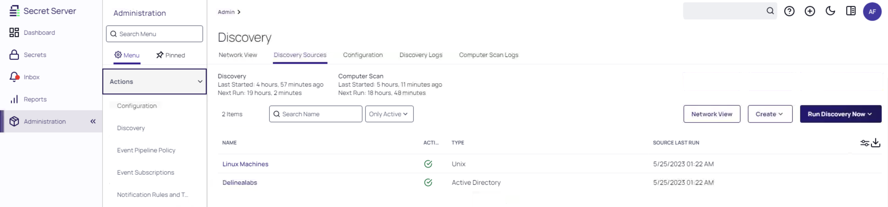
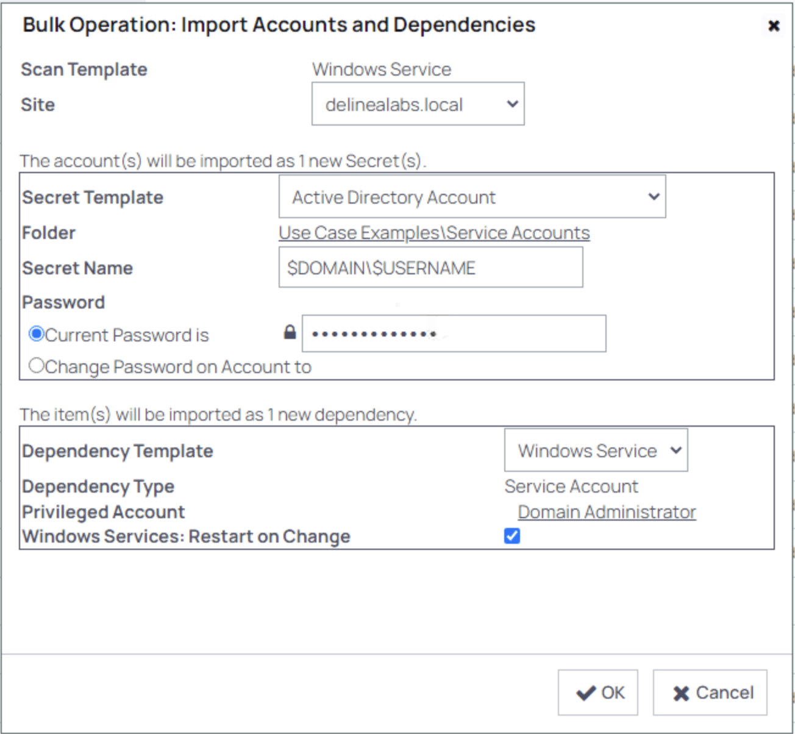
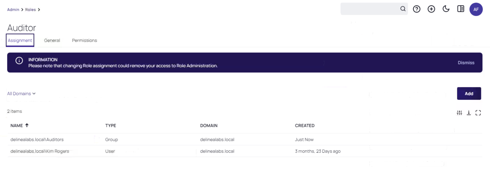

# Advanced Use Cases

## Discovery

Often Times the number and extent of privileged accounts within the environment is going to be unknown. Thus, the solution has an inbuilt discovery methodology which will allow us to identify privileged accounts which exist but that are not currently known by the PAM solution, to then onboard them.

As the user **Afoster**, login to Secret Server if you have close all sessions, and head to **Administration >> -> Actions -> Discovery**


 
You'll note that we have multiple discovery sources, Linux machine and Delinealabs (Active Directory) discovery. Click the **Network View** button, **NOT THE TAB**. Select **Delinealabs -> Computers**. Make sure that the **Local Accounts** tab is selected, and you will be presented with the local Windows accounts that have already been collected through a previously run discovery.


You will note that the entire Delinealabs domain can be expanded. Many account types can be discovered, from Active Directory accounts to Local Windows accounts, local SQL accounts, Oracle accounts, etc. These accounts, once discovered, can be manually on-boarded in to the PAM solution using the Import function, or automatically on-boarded using the "Create Rule" function. 

Take a look at these options and see if you can import a domain account!

## Service Account Dependencies

When it comes to privileged service accounts, it is not enough just to be managing the username and password combination. One must also manage the dependent services or applications that rely on this service account as well. These are referred to in Secret Server as dependencies and can be automatically on-boarded. Let's take a look. 

Click the **Service Accounts** tab. Here we can see that there is a *No Secret for Account* service account on the RDS01 server. The fact that this has been discovered and put in the service accounts tab, means that Secret Server has identified that it is running a service (delinealabs\svc_service1), but that it does not have a secret. 


!!!note
    The services that are shown with an *Unmanaged* status, Secret Server has detected that it has a secret for the account, but the dependencies, are unmanaged. So the password can be rotated (if configured), but the services that are run by the account are not being managed, like a restart.

Click on the checkbox to the left of RDS01 for the **Delinealabs\svc_service1** account, and then click the **Import** button. This will begin the process of importing this dependency against this particular Secret (ie service account).

!!! Danger
    Make sure you have the settings as shown in the screenshot below. If you don't check them, the secret, used in the next step, ends up in a different location. The password is the same as for any user in the domain.



Click **OK** and the dependency will import. Click **Close** when done.
 
From there, head to **Secrets >> -> Use Case Examples -> Service Accounts -> Delinealabs\svc_service1** and then go to the **Dependencies** tab. And there you have it, with a dependency added! 


You can see that the run result is a <font color="orange">orange i</font>. This will be marked as green when the password for our service account changes the next time.

!!! Note
    If you really want to manually run the dependency now, click the checkbox on the left-hand side of the dependency, when you hoover over it, and select **Run Selected Dependencies** and Secret Server will go out and make sure that this service is running with the correct credential. Another option is to click the circle form arrow to run the action. 

    

    After you clicked **OK** in the warning screen that appears if you select the run now, and a possible refresh of the browser, you will see that the <font color="orange">orange i</font> has gone and you now see two green checks. 

    

    Lots of different functions can be managed as a dependency. We can also build our own dependencies using scripting, depending on the external application that needs to be integrated. There's lots of fun possibilities here.

## Event Pipelines

Event Pipelines are the "if this, then that" engine in Secret Server, and allow us to automate some of the configuration of the solution with ease. 

While still logged in as **AFoster** head to **Administration >> -> Actions -> Event Pipeline Policy**


Event Pipelines consist of two overall configurations - Policies and Pipelines. Policies are essentially just containers for the pipelines that run within them and allow us to specify certain folders to which the pipelines within should apply. 
 
Create a new policy with **Add Policy**, and select **Create New Policy**. Give it an interesting name, set the Policy Type as Secret and click **Create**.


 
Press **Add Pipeline**, select **Create New Pipeline**, and click **Create**.


Pipelines have within them a number of items:

1.	*Triggers*. This is what triggers the pipeline to run. Triggers can be a large number of items.

    Use the search option in the lower part of the middle screen and search for **Launch** then use the **+** sign to add the trigger, and click **Next**.  This means that any Secret that gets launched, will trigger this pipeline. 

2.	*Filters*. These allow us to filter out (or in) items depending on what we are targeting with our pipeline. 

    In the search search for **Day of the Week** and set the day to **Tuesday** in the next screen that appears after clicking on the **+** sign, leave the Time Zone empty, click **Save**, and click **Next**

3.	*Tasks*. These are the actions that are taken by our pipeline once it is triggered. 

    Add the task **Secret: Add Custom Audit** and click the **+** and provide **The Secret was launched on Tuesday** as the text, and click **Next**

4. Provide a name and click **Save**


!!! Note
    To provide an explanation of the above pipeline. The trigger for the pipeline is Launch, any Secret that is launched our Policy get triggered via the pipeline. It checks the day of the week. If it is Tuesday, it then runs its task which is to add a custom audit to the launched Secret which says **The Secret was launched on Tuesday.** If the weekday is not Tuesday, it doesn't do anything.

There are an enormous number of potential options for event pipeline implementation - experiment with it and see what you can come up with! 


!!!danger
    Event pipelines can be used for a lot of automation beside the simple example we just built. You are able to run PowerShell scripts that provide an almost unlimited possibility on what an Event Pipeline can do. It even has the power to do bad things. Consider Event Pipelines in extreme forms as a Unregistered Nuclear Device...

## Custom Scripted Password Changer & API-based interaction

Secret Server features a fully functional REST API that can be used for retrieving (and altering) information within the solution.

Head to the **API Examples** folder on your Desktop and you will get access to two scripts. Right-click on the **Windows Authenticated API.ps1** file and click *Edit*. This will open the script in *PowerShell ISE*. Click the *green play button* to run it. This will connect to Secret Server and retrieve the password for Secret number 30 and display it in green. 

Let's take a look at the script in a little bit more detail. 

``$api = "https://sspm.delinealabs.local/secretserver/"``

This URL is the location of the Windows Authenticated REST API in Secret Server in this lab.

``$secretId = "11"``

This identifier is the SecretID, a unique integer value that is unique to every secret. Use this to lookup information from a specific Secret.

``$fieldvalue = "password"``

This is the field for which we want to retrieve the value. We could change this to "username" or any other field name upon the Secret we are trying to retrieve.

``` Powershell

$headers = New-Object "System.Collections.Generic.Dictionary[[String],[String]]"
$headers.Add("Content-Type", "application/x-www-form-urlencoded")

$body = "username=delinealabs\krogers&password=Delinea/4u&grant_type=password"

$response = Invoke-RestMethod "$api/oauth2/token" -Method 'POST' -Headers $headers -Body $body
$bearerToken=$response.access_token

$result=Invoke-RestMethod -Uri "$api/api/v1/secrets/$secretid/fields/$fieldvalue" -Headers @{ 'Authorization' = "Bearer $bearerToken" } -Method GET

```
This is the preparation for the REST call to the Secret Server API based on bearerToken. 

``Write-Host $result -ForegroundColor Green``

This line simply writes out the resultant retrieved Secret value, depending on what we have specified above.

!!! Note
    The **API Based Search.ps1** script is also available. Running this will allow you to use the script to search through the Secret Server API for search terms (currently it is set to **OpenSense**). This will then return the corresponding Secret ID and the name of the Secret.

    **Below are some examples. Your environment will look different and secret ID 32 might not even exist.**

    

    You can also find the SecretID of a Secret through the URL address bar:

    

    A full REST API guide is available from within the tools menu in the  Secret Server UI via **Administration >> -> Actions -> REST API Guide**

    


## Administering RBAC

Ensuring that only the correct users have access to the correct Secrets, is essential in configuring any PAM solution. User's access in Secret Server is determined by both Role (the permissions in the role) and permissions on folder and secrets. If permissions are not defined, the user will not have access. 

### Roles

Roles can be customized on the basis of over 130 permissions. Head to **Administration >> -> Users, Roles, Access -> Roles**, click on **User** and click on the **Permissions** tab and click **Add**. Here you will be able to add individually permission assignments to the user role by dragging and dropping. 


Or drop the permissions by hoovering over the permission and click the **bin icon**


Users can be assigned to roles either individually or through group membership. In **Administration >> -> User, Roles, Access -> Roles** click **Roles** and take a look at which users and groups are assigned to each role. This can be fully customized, based on your organizational requirements. The below screenshot if of the **Auditors** role



### Folder and Secret Permissions

Access to Folders and the secrets within them can be fully customized by right-clicking on any folder and clicking **Edit Folder**. 

Note that permissions to the folder and the secrets within are independent permissions. The below screenshot has been made from the **Database Accounts** folder and the **Permissions** tab.


As shown above, access can be granted to groups (either internal to Secret Server or Active Directory Security Groups) or individual users for Folders. This principle is also valid for Secrets themselves.

Folder permissions can set to folder level, but also on the secrets in the folder. For more detailed information on folder permissions, <a href="https://docs.delinea.com/secrets/current/folders/managing-folders/editing-folder-permissions/index.md" target="_blank">follow this link</a>

Secret Permissions can be set to Owner, Edit, View or List. For more details on secret access permission, <a HREF="https://docs.delinea.com/secrets/current/secret-management/secret-permissions/index.md" target="_blank">follow this link</a>.

!!! Note
    If a user does not have access to a folder, it won't even appear for them in the folder tree, even if they have lots of administrative role permissions. The RBAC is designed to be enforced granularly to ensure that only the correct users have access to the correct permissions at the correct point in time. 
