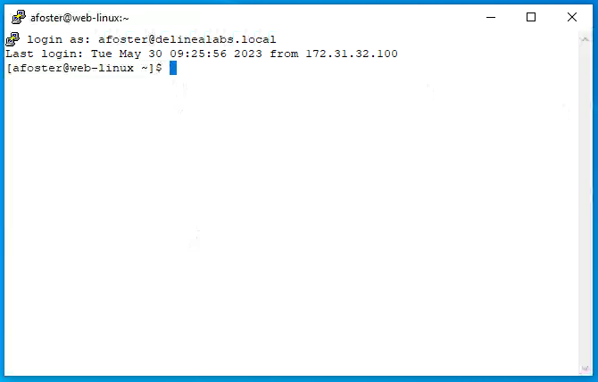

# Just-In-Time (JIT) Privileges

## An introduction

### What Is Just-in-Time PAM?
Gartner released a research report in 2019 titled, "Remove Standing Privileges Through a Just-in-Time PAM Approach," where the analyst firm looked at this approach to Privileged Access Management with two goals in mind: Just-in-Time PAM, and Zero Standing Privileges (ZSP).

"The fundamental purpose of a JIT/ZSP approach is to reduce the attack surface for privileged access abuse. Basic PAM (vaulting and session management) will help mitigate the risk of the existence of privileged accounts. JIT reduces the risk of privileged access abuse, and ZSP reduces the attack surface of the privileged accounts themselves," the Gartner report says.

It also goes on to say that, "Zero standing privileges is the purest form of JIT, which addresses the final guidance of the principle of least privilege 'at only the right time,' by eliminating the risk of standing privileges."

### Where Does Just-in-Time (JIT) Fit In?
When thinking about why organizations embark on PAM projects, I know from my time in this space I've seen two very constant requirements that have not changed:

- Reduce the number of Privileged Accounts within an organization.
- Reduce the risk associated with users having privileged access.

For the rest of this lab, we're going to focus on point 2 - reducing the risk associated with users having privileged access. This requirement is currently morphing, as digital transformation leads to technological changes. We now need to worry about the risk associated with systems, APIs, and service accounts having too much privilege, as well as users.

Privilege really is a necessary evil but that doesn't mean it's a bad thing. It just means we have to apply controls around its usage.

There are two things that we can really control here:

Scope - Just Enough Access

- What systems of applications can the user access?
- How much privilege does the user or application require in order to perform its function?

Time - Just-in-Time (JIT)

- When do they need the privilege?
- How long do they need it for?

As the Privileged Access Management vendor landscape changes with a move away from pure vaulting and new vendors enter the landscape with solutions explicitly for the Just-in-Time PAM space, it's important to remember those two points above because not all solutions were created equal. Those that can control the time element cannot necessarily control the scope element, and vice versa.

## Linux

As mentioned in the above introduction we want to make sure that users have the right privileges to do their day-to-day job. Not give them all privileges. This part of the lab is about two scenarios:
1. The first scenario is about a new admin named Tim Smith (TSmith) that just came to the organisation as a Linux admin and should only have rights to log in to the CentOS server and have view rights, without restricting him to a so called restricted shell where only a few commands can be run. So he will have the same rights as a "normal" Linux user on the system. To login to the system, Tim is told he can only login using his own account
2. A user called (user, that we have been using throughout the lab), that is also a normal user, but due to his role in the organisation can update some packages (wget and zip) and control the Mail server (postfix based) that is running on this server. For the rest this user has no extra privileges.

### Scenario 1 - TSmith

While still being on the client machine, open a Putty session to the **centos.thylab.local** and login as **tsmith@thylab.local** using the password **Delinea/4u**. Try to run the following commands and see their outcome and compare them to the table below:

| Command              | Password needed | Allowed/Result |
|----------------------|-----------------|----------------|
| cat /etc/passwd      |       No        |  Yes           |
| cat /etc/shadow      |       No        |  No            |
| yum update wget      |       No        |  No            |
| sudo yum update wget |       Yes       |  No            |
| dzinfo               |       No        |  Yes           |

As you can see from the table, or you have run the commands, not much Tim can do. The last command ``dzinfo`` is a specific command that is asking the agent which privileged commands, if any, have been given to the logged in user. The result of the command is that no privileged commands have been given to TIm, but he was able to login using his AD credentials.

Close the Putty session.

### Scenario 2 - User

In this scenario we are going to see what the account **user@thylab.local** can do. Login as that user using Putty and provide the username **user@thylab.local**. As seen before, a password is not needed as we are already authenticated against AD on our Windows machine.

No run the same commands as for user tsmith and check the outcome of the commands in the table below

| Command              | Password needed | Allowed/Result |
|----------------------|-----------------|----------------|
| cat /etc/passwd      |       No        |  Yes           |
| cat /etc/shadow      |       No        |  No            |
| yum update wget      |       No        |  No            |
| sudo yum update wget |       Yes       |  No            |
| dzinfo               |       No        |  Yes           |

The outcome should be almost the same as for the  TSmith account, but the last command gave more information

The result of ``dzinfo`` shows that three commands can be run with elevated privileges:
1. yum update zip
2. yum update wget
3. systemctl.*.postfix

Problem is that we ran the second command, even as sudo, but the commands were not allowed by the system. Now run that same command (``yum update wget``) but add ``dzdo`` in front of the command

As you can see now the command is running and there is no error message. This ``dzdo`` command is checking to see if the user has the permission to run the command with elevated rights. And if that is the case, it will run it with elevated privileges.

!!! Note
    In most cases there is nothing to update, but at least the command has been executed, wit elevated privileges.

    

The last command ``systemctl.*.postfix`` is a regex filter that allows all valid parameters for the systemctl command, but only for the postfix service/daemon. To check that, run ``systemctl status postfix`` and see that the daemon is running

!!! Note
    We don't need elevated privileges as this is a none intrusive command. All users can ask for the status of services

Now try to run the following commands and see the outcome:

| Command                      | Password needed | Allowed/Result |
|------------------------------|-----------------|----------------|
| systemctl stop postfix       |       No        |  Yes           |
| dzdo systemctl stop postfix  |       Yes       |  Yes           |
| systemctl status postfix     |       No        |  Yes           |
| dzdo systemctl start postfix |       No        |  Yes           |
| systemctl status postfix     |       No        |  Yes           |

After the first ``dzdo`` command the AD Password is needed. As you have authenticated using the password, the second time you ran the ``dzdo`` command to start the Postfix Daemon, a second time providing the password is not needed.

### Conclusion

The two described scenarios are solved by the configuration that has been made in the Server PAM solution. Users that are allowed to login can login, but will be normal user. The user@thylab.local account has been give three commands that the user can run with elevated privileges.

!!! Note
    To test this more, try to run any other command, example ``dzdo yum update -y``, and see thta that command is being blocked by the system. Also any sudo commands, ``sudo yum update -y`` as example, are blocked as the user is not in the so called **sudoers file**

Close the Putty session.

## Windows

For Windows we can do the same thing, but this lab goes a bit further. The following scenarios are going to be discussed:
1. Only allowed users can access the Windows server RDS01 (**THYLAB\user** and **THYLAB\adm-training**), not even the Domain Administrator account is able to log in
2. Account **THYLAB\user** is allowed to login as a normal user, but due to the persons role, the Eventviewer, the security part in particular, can be opened. Also the Windows Firewall can be opened by this person, but only after authenticating again using its corresponding AD password

### Scenario 1 - Block domain administrator access

A reason for not allowing the Domain Administrator to login to the system is due to accountability. This account should be considered a shared account and it's hard to hold people accountable.  All actions are being logged in the event viewer as THYLAB\Administrator and not the person that used the account. By only allowing specific user accounts, named account (they can be tied back to ONE person) we can held the people accountable.

Open the console of the RDS01 by clicking on its icon in the Skytap environment and login as the account **THYLAB\Administrator** with **Delinea/4u** as the password. You will get a message that **The account is not authorized to log in from this station** and click on **OK**

Try to do the same on the DC1 and see that you can login using the same credentials. Hence the account is capable to login to the DC and should be, default, be able to log in to the RDS01, but a configuration is blocking the access.

Sign out of the DC1

Back at the Client, try using the Remote Desktop Connection (Start menu > mstsc) and notice that the same message appears as on the console **The account is not authorized to log in from this station**. CLose the connection, or wait a few more seconds and it will close by itself.

### Scenario 2 - allowed users

Open the RDS01 console again, and login as **THYLAB\user** this time with the known password **Delinea/4u** and see that that user CAN login to the RDS01 server. Now the user is a normal user and has no extra privileges. On the desktop, click the Eventviewer and try to open the security info. THis will not be allowed, but the user can see the other information of the system as a normal user, which is allowed to login to a server by default.

Do the same for the Windows Firewall that is shown on the Desktop where you will also see no information.

Leave both applications open by minimizing them.

Right click the Eventviewer and select **Run with Privilege...**

Now open the security information and see that the information is shown. Return to the other eventvwr and refresh the page on the security information. This is still blocked as having no access. So only the second eventvwr is running with elevated privileges. The same will be the case with the Windows Firewall. Only the second "session' will be run with Elevated Privileges. For the Windows Firewall > Run with privileges... the account's password has to be given as this setting can have a big impact on the security in the system. The password is a form of MFA.

### Conclusion

Both example scenarios have been solved by the set configuration.

