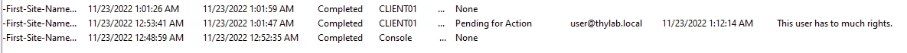

# Auditing and Monitoring

The Delinea Audit & Monitoring Service enables you to create and manage an audit infrastructure - the **audit** installation - to store and query sessions based on the criteria of interest. In addition, audit events allow you to record successful and failed operations and integrate with incident monitoring programs to generate alerts and automate responsive actions.

## Direct Audit via the agent

One way to perform audits is to have an agent installed on the machines that are to be audited. The agent can be installed on the same supported versions of the Operating Systems (Windows and *NIX) as the Privileged Elevation Services.

### Generate some auditing information

To be able to see something, let's generate some information for the Audits. With help of the Remote Desktop Connection on the Client, or the Secret Server secrets you have, open a session to the:

1. SSPM
2. DC1
3. RDS01
4. CentOS

!!!info
    For the Windows machines use the **delinealabs\adm-training** account to log in. On the CentOS machine use the **user@delinealabs.local** account. Log in with **Delinea/4u** as the password for machines. The CentOS server should allow login without the password needed. This due to the Kerberos ticket which exists due to the login to the client.

In the sessions, start some applications, or run some commands and close the sessions so there is some information available in the audit.

### Look at the generated audit

On the **Client VM** open the Audit Analyzer (on the Desktop) and navigate to **Audit Analyzer -> Audit Sessions -> Today**

!!!tip "Remark"
    The above screenshot will look different in your environment.

By double clicking on one of the lines you can see what has happened. All should be very familiar.
Click in the menu bar the **Session** text and select **Pending for review** 

Provide some text in the message box that appears and click **OK**.

Click the DirectAudit screen (the window where the video is displayed). Back in the table view, refresh the page and look for the line that you have double clicked. Scroll to the right and see that your remark is displayed and the status of the audit.

Using this process, auditors are capable of documenting their progress and share information with each other.

!!!warning

    This process can only be used internally. When it comes to court, the storage that is used for the storing of the videos is not putting the videos in a legal hold mode (meaning **nobody** can alter the content). This means that the videos can be altered in favor of defended and offender and will not hold in court as evidence...