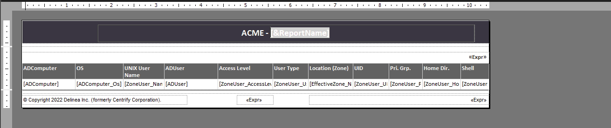

# Reporting

Delinea report services provides reports on your Active Directory environment and the data is stored in a database that’s optimized for reporting. You can synchronize your Active Directory information to your reporting database, and then allow your users access to the reporting data.

You can choose to use SQL Server or PostgreSQL for your report database. If you use PostgreSQL, you must provide your own report software to create and view reports.

If you're using SQL Server, the following diagram illustrates the main report services architecture components:

If you're using PostgreSQL, the following diagram illustrates the main report services architecture components:

Delinea report services takes data from Active Directory at a particular point in time. The data collected at that point is sometimes referred to as a snapshot. The Active Directory data synchronization service puts the Active Directory data into tables in the reporting database, and then runs some algorithms on those tables. Some data is pulled over directly from Active Directory as it is, and some data is calculated.

For example, the effective role assignment for each computer and user is calculated rather than stored. Delinea does store the effective role assignment information at the levels of role, computer, and zone. This information is then stored in the database views, and those database views provide the information that you see in the reports.

The reporting service populates database views based on the data in those tables, and those views are what are used to populate reports.

Database views provide an easier and more secure way to share the reporting data without having to expose the database tables directly. Each view is essentially a database query. Some columns refer to columns in other views, and these relationships are noted.

Each default report is based on one or more of those database views, and you can build custom reports based on the information stored in one or more of those views.

For SQL Server databases, Delinea report services uses Microsoft SQL Server Reporting Services as the reporting engine for deploying and customizing reports. You can use any reporting service to generate reports by connecting to the reporting database.

## Using the Delinea MS SQL Report Services

As the standard user, open Chrome and click the **Delinea SQL Server** button in the bookmark bar

You will be "logged-in" automatically. Click the **Delinea Report Services** folder. This will show all reports, per category, that are available after the default installation and configuration.

!!!note
    If you get an error message, please wait a few minutes and then refresh your browser. Sometimes the reporting services was not ready and opening the URL for the first time, will trigger the start of the processes. A refresh will then be able to connect to the underlaying processes for the reporting.

Navigate to **Attestation Reports folder > PCI Reports > PCI - Login Report - By Computer** report

Change the **Zone** field to *--- ALL ---* and click the **View Report** button on the right side of the panel. This will create a report that shows the information requested.

The report can be saved in various formats. Click the Save icon and see what is available.

!!!note "Remark"
    It is even possible to work with subscriber and emailing reports on scheduled bases. This has not been configured in this demo environment. This function is something that can be configured using "normal" Microsoft configuration steps as described [here](https://learn.microsoft.com/en-us/previous-versions/sql/sql-server-2008-r2/ms345234(v=sql.105)?redirectedfrom=MSDN).

Have a look at what else is available in the Reporting Services with respect to reports.

## Customizing reports

Besides the available reports, you can also customize the existing reports, or even create your own. 

!!!note
    This process of customizing a report is out of scope for the demo environment, but you still will be able to see the first steps to open existing reports and see what is needed to change them to requested needs. This demo will do a small update to an existing report.

Navigate to **Home > Delinea Report Services > Access Manager Reports** folder and click on the three dots next to a report name Authorization Report, and select **Edit in Report Builder**

A warning screen will open asking if Chrome should open the Microsoft Report Builder? Click **Open Microsoft report Builder**. 

!!!tip
    The other message you will close as soon as we return to the Chrome session

This will open the Report Builder and the report can be changed to the needs of the user. Maximize the window and click on the text **[&ReportName]**. Navigate all the way to the left and provide an organisation name like **ACME -**

Click the Run button (top left corner) to see the report with the new name at the top

Click on the Design button to return back to the design screen. Close the application. A warning screen will appear asking if the report needs to be saved to the report server. Click **Yes**

Close the message that was still there about the Report Builder. Now rerun the report and see that the report is showing your changed report name.

Close the Chrome session to the reporting services as this concludes the chapter

!!!tip
    As this demo guide is not going in depth into Report Builder, there is a lot of information on the internet in Videos on YouTube and articles on how to create reports. Even from scratch. A good starter might be [https://www.sqlshack.com/ssrs-report-builder-introduction-and-tutorial/](https://www.sqlshack.com/ssrs-report-builder-introduction-and-tutorial/)
