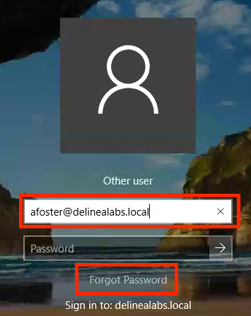
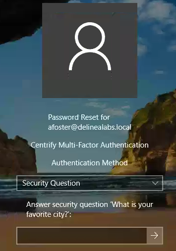

# Reset user's password

One of the most occurring issues helpdesks and IT departments face is users that have forgotten their password to get into systems. The ServerPAM solution has that covered by doing this as a self-service for the users.

## Change the standard user password

Open the console of the RDS01 server and log out all users that are logged in, if any.
In the username type **afoster@delinealabs.local** and click the **Forgot Password** text to start the reset password process

Click the right pointing arrow to get to the next step and change the **Authentication Method** to *Security Question* as we can not open our email application.

Answer the security question. If you have answered the question correctly, you can set the password (twice) for the user. Pick your password, but be 100% sure you remember it.

After a successful finished process a message is shown that the password has been changed and that you need to use the newly set password to be able to login to a system

Now try to login to the RDS01 with **afoster@delinealabs.local** and your new password. You should be able to login using that new password without any issue.

Log out of the RDS01

