# Zone Request Workflow

Zone role workflow allows you to set up a workflow process so that access to computers in Delinea zones can be requested, approved or rejected, and tracked.

With zone role workflow:

- Users can request assignment to a role that's defined for a specific computer in a Delinea zone.
- After the user requests the zone role assignment, the approver can grant access either temporarily or permanently or reject the request to deny access.
- Once the approver grants access by approving the request, the service assigns the user to the zone role on that computer and updates Active Directory automatically. The user now has all the privileges defined in that zone role.

When you enable your deployment to use zone role workflow, you also specify the following:

- Which users can submit requests
- Which users can approve requests
- Which systems can have access requested and approved
- Which zone roles a user can request that are available on the specified systems

You can enable and configure zone role workflow at the domain level. After you enable and configure a workflow at the domain level, all systems in the domain use that zone role workflow by default. You can then override or disable the default workflow at the system level. The system-specific settings that you specify override the domain settings.

For example, you might enable and configure zone role workflow at the domain level to establish default settings for role availability, approvers, and requestors. Then, you can use system-specific settings to have individual systems opt out of the zone role workflow or to override role availability and approver settings for specific systems.

Users requesting zone role assignment must be domain users, and must be assigned at least one administrative right with access to the Privileged Access Service with permission to View objects in the Admin Portal.

Approvers do not need to be domain users. Approvers can be specified individually, or by group membership.

## The use case - Linux

In this demo a user Lucy Andrews is been asked to login temporary into the web-linux and db-linux server to perform an update for the ZIP and the WGET packages. As she has not been allowed access by default to the system, she has to request access by using the Zone Request Workflow. After the request has been approved, by afoster, she will be able to login to the systems and run the needed commands with elevated rights.

### Running the use case - current situation

On the client (logged in as the **afoster**), open Putty and connect to the **web-linux** machine. Try to login as **landrews@delinealabs.local** with **Delinea/4u** as the password,and see that you are not allowed to login.

Close the PuTTY session and open the **Direct Access Manager** on your desktop, the application is show as the "D" on the white background in the taskbar and click **Yes** in the UAC.

!!!note
    When you get the message windows on *Connect To Forest*, click the **Connect as another user** and use **adm-training** with **Delinea/4u** as the credentials to connect to the Domain controller mentioned.

    This has to be done in this case as the user that is logged in on the Windows machine doesn't have the correct permissions to change anything in the Direct Access Manager.

    

Navigate in the Direct Access Manager to **Access Manager > Zones > Global Zone > Child Zones > Unix Servers > Computers > web-linux**. Right click the **web-linux** and select *Show Effective Rights*. User **landrews** is not shown. This means that the user has NO access rights and that corresponds with what we have noticed while trying to login to the CentOS system using PuTTY.

!!!note
    When you check the **Show omitted users** checkbox, landrews will show up in red. This means the system knows about the account, but has not been given rights/roles on the system.

    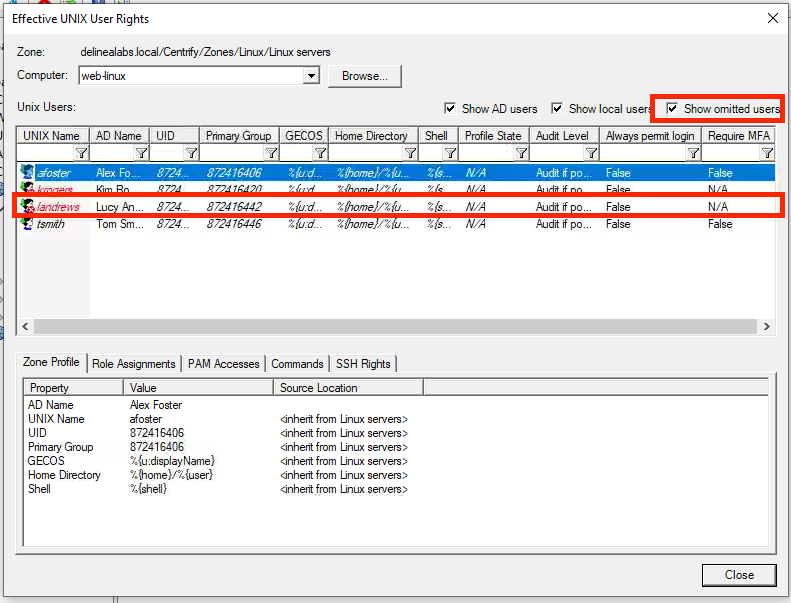

Click **Close** and you will be returned to the Direct Access Manager. Don't close the Direct Access Manager as we need it in a few.

### Running the use case - Zone Request Workflow

Open Chrome and navigate to **https://hspas.delinealabs.local**. Logout Alex Foster, and login as **landrews@delinealabs.local** with **Delinea/4u** as the password. This will open up the Admin Portal for Lucy Andrews. Navigate to **Resources > Systems** and see that three systems are showing.

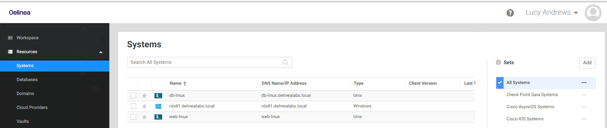

Right click the *web-linux* machine and select **Request Zone Role**

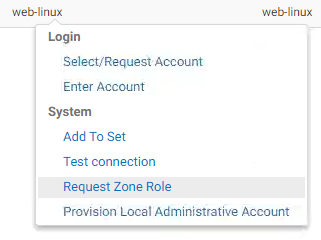

Select the **UNIX Login/Linux servers** role that is shown. And click **Select**. In the next screen make sure you change the **Start Time to 1 Minute** and don't leave it default. If you have done so, you have to wait 60 minutes, or re-request access, before access is granted **AFTER APPROVAL** and click **Submit**.

Now that the request has been made and an approver has to approve, you may have noticed that a message came into the screen about a received email (if MS Mail App is open).

Open MS Edge and goto https://hspas.delinealabs.local. You will be automatically logged in as Alex Foster. Navigate to **Access > Requests**. All requests are shown. 

!!!note
    If you opened the email, and clicked **View Request** you would go directly to the above location in the Admin Portal.
    
    

Click the **Pending** request from LAndrews@deleainlabs.local and see the details of the request.

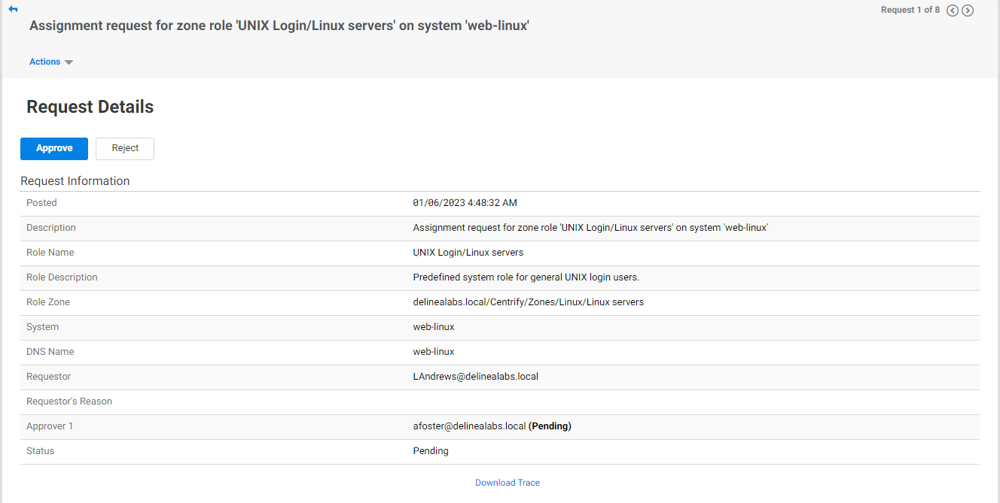

Click **Approve** and in the next screen just click **Submit**.

!!!note
    This is where the approver can make changes to the request with respect to times,

    

Open the **Direct Access Manager** again and navigate to **Access Manager > Zones > Global Zone > Child Zones > Linux servers > Computers > web-linux > Role Assignments**. LAndrews@delinealabs.local has been given the **UNIX Login/Linux servers** role. This would mean that she now has the possibility to login to the web-linux machine. There is a timed window in which she is allowed to login. 

Open PuTTY, connect to the **web-linux.delinealabs.local** machine and login as **landrews@delinealabs.local** and see that you will be able to do so. 

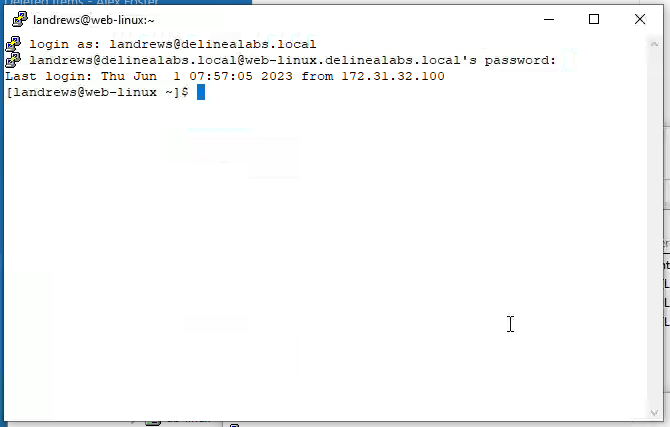

Now that landrews has logged in, she is still not able to run any specific commands needed to update the zip and wget packages. Try to run the following commands and see that they will always fail.

- `yum update zip`
- `yum update wget`
- `sudo yum update zip`
- `sudo yum update wget`
- `dzdo yum update zip`
- `dzdo yum update wget`

Error examples for the wget commands

To see what is allowed to the user, run ``dzinfo``. At the bottom of the returning information it shows no Privileged commands available

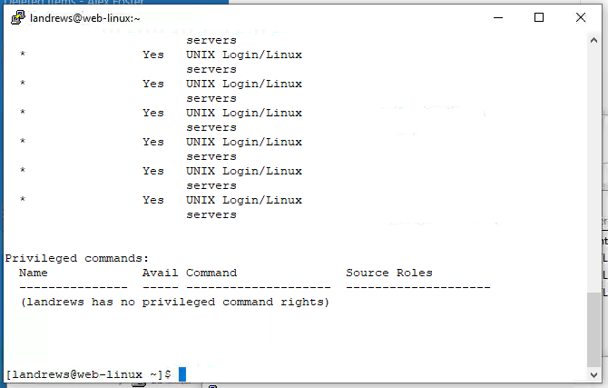

Open Chrome, where LAndrews is logged in, and right click web-linux again, select **Request Zone Role**, click the **Management/Linux servers**, click **Request**, change the **Start Time in 1** and click **Submit**. Approve the request as afoster in the Admin portal. Return back to the PuTTY session and see that after a few seconds you will see the newly requested role assignment by running the ``dzinfo`` command.

Head back to Direct Access Manager and refresh the Role Assignment, and also see that LAndrews has been assigned the Role **Management/Linux servers**

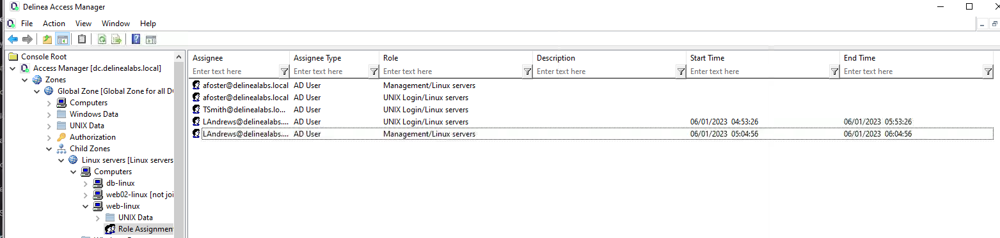

Back in PuTTY, as account landrews has been given the Role, the following commands, as shown in the `dzinfo` returning info, are to her disposal:

1. `dzdo yum update zip`
2. `dzdo yum update wget`

Run these commands and see what happens. All these commands will be allowed and on the `dzdo yum update zip`, MFA challenges are given.

The roles can be removed from the user, if they have been given by mistake, by removing the roles in the Direct Access Manager. Remove the two lines that are shown for user LAndrews in Direct Access Manager, by selecting both of them and click the Delete button. Wait a minute and see what happens to the session....
After a few all given rights are stripped from LAndrews account. Even the login rights, but as the session has already started that will still carry on. This is a SSH "limitation" as long as the session is active, it can not be broken if there is no "Proxy" or other controlled mechanism in the system. What we do know is that all privileges have been stripped from the user and that if the session is broken, getting in is not possible anymore.

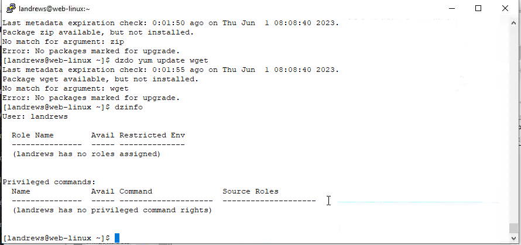

Close all active PuTTY sessions

## The use case - Windows

In this demo a user Lucy Andrews is been asked to login to the RDS01 server and check the Security information on the system and make changes to the Firewall setting if needed to block some ports/applications. As Lucy is an AD user and in the group that is allowed to RDP into the RDS she is able to login to the system using her own account. The ony issue is that Lucy is not in the office, but has access to the Admin Portal from her location. She is going to use this portal to gain access to the RDS server.

!!!note "Remark"
    As we don't have a 100% alike situation, we are going to mimic this using the Admin Portal and open a HTML RDP session via the Admin Portal.

### Running the use case - current situation

On the client head back to the Admin Portal in Chrome where LAndrews is still logged in. Right click the **rds01.delinealabs.local** server and select **Enter Account**

Provide A justification and click **Continue**. The next screens are MFA challenges to make sure that the user requesting the access is Lucy Andrews. Make sure you select the **Security Questions** when you are asked for the sort of MFA challenge. All MFA answers are the same as you have used earlier for other users.
The last screen you get is the **System Authentication** screen where you provide the credentials **landrews@delinealabs.local** as the username and **Delinea/4u** as the password. 

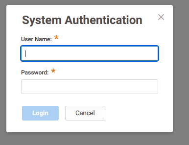

This will open a RDP session to the RDS01 server. Open the Event Viewer and try to open the Security info and see that you are not allowed to do so. Do the same for the Windows Firewall and also see that that is not allowed.

### Running the use case - Zone Request Workflow

Reopen the Admin Portal while leaving the RDP session open! Right click the rds01.delinealabs.local server and select **Request Zone Role**. Select the **Event Viewer and Firewall/Windows Servers** role and click **Request**.

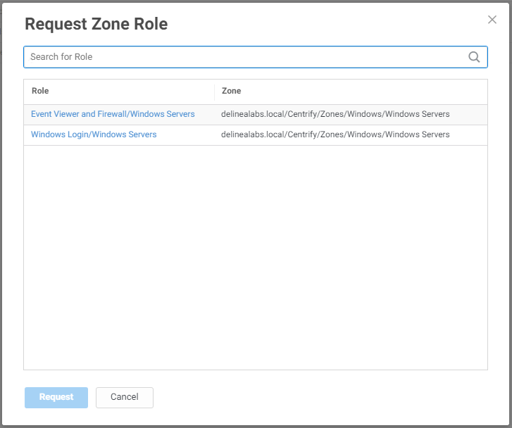

**Make sure to put the Start Time at 1 Minute!!!** and click the **Submit** button. Approve the request received via the emailor the Admin Portal as user Afoster, and return back to the RDP session.
In the RDP session click the up pointing arrow in the taskbar and right click the Delinea Logo. Click the **Authorization Center** which will open a new window

Click the **Effective Roles** tab and see that the Role has been assigned to the user.

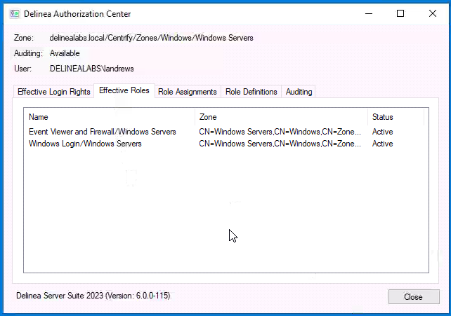

!!!WARNING
    In the screenshot,as there has been some time between requesting the role and opening the Authorization Center, it has been put on Active. If you don't see the requested role, wait a few minutes and reopen it. To force the new role to the agent, open a cmd as delinealabs\Administrator with Delinea/4u and run ``dzflush` to update the cache now.

Now that the role is assigned and active, close the **Authorization Center**.  On the desktop right click **Event Viewer** and select **Run with Privilege...**

You will be faced with MFA challenges. If they have been correctly answered, you will see the EventViewer, AND are able to see the Security information.

Try to do the same for the **Windows Firewall with Advanced Security** and see that the process is the same and that after a successful answering of the MFA, the account is able to change the Firewall settings

As done with the Linux environments, in Direct Access Manager you will see the assigned role for Windows machine under the **Role Assignments** for the RDS01 server

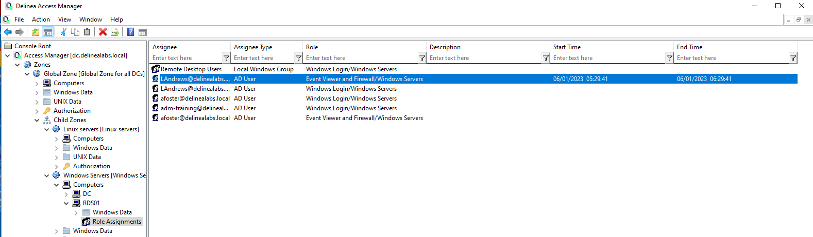

Close all open Windows and applications you might have used during this chapter.