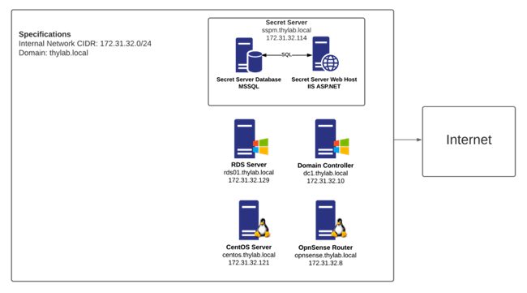

# Introduction

This lab guide is designed to be used alongside lab instances provided for Delinea Secret Server. These have all been configured for the appropriate personnel. The guide covers a number of different Privilege Access Management use cases, giving the user an overview of the solution’s broad capabilities. 

 The components featured within the lab are fully pre-built, hence no software installation will be required within the lab.

The guide is designed to assist you to explore the varied functions available in the solution, but is not meant to be an authoritative guide to all functions available. Hence, feel free to explore the options available to you and don’t hesitate to reach out to your Delinea liaison should an additional feature or function take your interest. 

## Solution Overview - Delinea Secret Server
Delinea Secret Server is an enterprise-grade Privilege Access Management (PAM) solution that is designed to allow organizations to streamline and control access to organizational privileges effectively and rapidly. 

The solution is delivered either as a Cloud (SaaS) delivery model or in an on-premise format, giving customers large amounts of deployment flexibility. For on-premise, the solution leverages Microsoft standards (MSSQL database backend and IIS ASP.NET frontend) allowing customers to take leverage in-house Microsoft knowledge in establishing and managing the platform. High Availability and Disaster Recovery can be embedded into the solution at every layer, ensuring that the deployment is robust and highly available.

Authentication to the platform can be provided based on user identities in numerous directories, including Active Directory, Azure Active Directory, SAML and LDAPS. In addition, role-based access within the service can be managed through directory group membership, enabling organization-wide flexibility of access. The solution supports a wide range of MFA options including RADIUS-based authentication (any provider), OTP, FIDO2, Yubikey, Duo and e-mail. This includes the Microsoft and Google authenticators. MFA methods can be enforced and selected on a per user basis, giving full flexibility in MFA deployment. A SCIM connector is also available, further enhancing integration options with external identity providers such as IBM IGA. 

Numerous different privileged account types can be stored and managed by the platform including: Active Directory Accounts, Local Windows accounts, Linux/Unix accounts, SSH Keys, Database admin accounts (SAP, Oracle, Sybase, Postgresql, etc), Mainframe accounts (IBM  iSeries), Network device accounts (Palo Alto, Cisco, Checkpoint, etc), Cloud admin accounts (for AWS, Azure, GCP and IBM Cloud), Hypervisor accounts (Vmware, Vsphere), and out of band accounts for HP iLO and Dell iDRAC cards. 

A huge range of integrations exist for external platforms such as vulnerability scanners, identity providers, CI/CD pipeline platforms, ticket systems, SIEM solutions, and more, allowing the PAM solution to rapidly become a foundational element of the organization’s holistic security schema.

## Terminology
Throughout this guide privileged accounts will often be referred to as "Secrets'. This is simply solution-specific wording for privileged accounts that are stored.

### High Level Architecture
The Secret Server installation in the lab is architected as follows. 

Deep knowledge of the instance architecture will not be a pre-requisite for completing the Use Cases within this guide, as the PAM solution itself handles the networking required for establishing privileged access.

 

#### Components

**Secret Server (Application)**
This is the Secret Server server which houses the frontend IIS ASP.NET web application server and the backend Microsoft SQL database server (single database) which powers the solution.

**Domain Controller**
The lab has it’s own Active Directory domain (thylab.local) for which there is a single Domain Controller. The domain includes various test user accounts with varying levels of privilege, in addition to standard Active Directory Security Groups that can be used to determine user access levels within the solution.

**RDS Server**
This server can act as a "jumphost" for privileged session launches. A jumphost is not a mandatory component of session launching within Secret Server, however this server can be used to demonstrate the capability within the lab - thus emphasizing the general flexibility of the solution.

**CentOS Server**
This server is a Linux server for which there are associated SSH keys stored within Secret Server. It is used as the SSH launching example server.

**Virtual Router and vRouter**
These are respectively an OpnSense and a VyOS Routers with multiple NICs that is used to demonstrate both SSH launching as well as web administrative portal launching. 