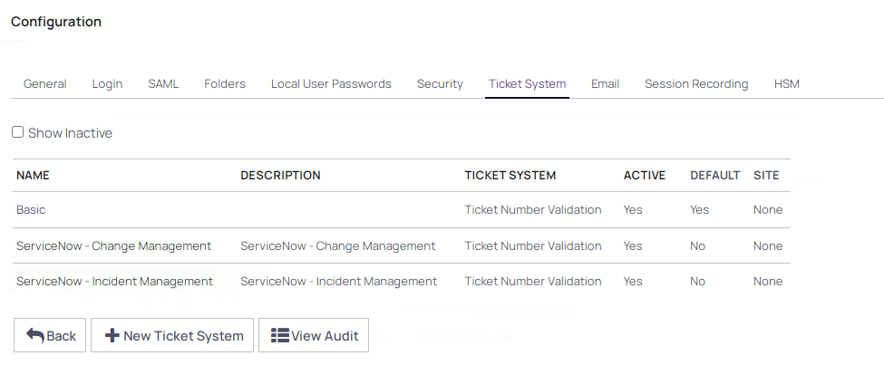

# General Use Case

## Authenticating

We will assume that your lab is already switched on. If not, you'll need to press play and wait at least ten (10) minutes until the lab is ready for use.

The first, tentative step you're going to need to take into the lab is to authenticate with the "Client" device as a standard Active Directory user. Fortunately, SkyTap makes this easy for us.

Click on the "Client" to get started and a new tab should open, and you'll be presented with a Windows logon screen. 

 

Log in to the device with the **Standard User** user by pressing the arrow down, pressing CTRL-ALT-DEL and then inserting the password into the password dialog box using the insert button. (the password for **thylab\user** is the correct password)

 

With any luck, you'll now be in! 

Next, we want to gain access to Secret Server itself. For that, we are going to need Google Chrome, so go ahead and fire it up and you should be presented with the Secret Server login screen after some time. Upon first load the application may take some time to appear.

---

**NOTE:**

If the login page doesn't automatically appear, head to: **https://sspm.thylab.local/secretserver**
You should then be presented with the login panel. If not, panic…. just kidding. Speak with your Delinea representative for further instruction if the login panel just doesn't appear.

---

You'll want to authenticate with the username user (not thylab\user - just user) and the password will need to be inserted from the SkyTap credentials panel (see previous instructions for the thylab\user password). 

---

**NOTE:**

You do also have access to an admin user. Leave this one for now - we'll get to some solution administration a bit later on.

---

## The User Interface
The User Interface (UI) is designed to be intuitive, even for beginner users of the solution. The left-hand side pane features a range of selectable sections including home - where a dashboard is displayed - through to Recent Secrets, Favorites and then down in the bottom left the folder structure. Many panels are customizable. A search function exists both in the top right - which will search the entire solution - and then there is often an "intra view" search function, notated by a magnifying glass, which will allow you to delimit your view by certain search criteria.

---

**NOTE:**

The *folder structure* is hugely important - it allows us to store different types of Secrets for different use cases in areas which cannot be accessed by users unless they have been explicitly granted access. Note that there are multiple example structures in the lab. Structures can be completely customized on a per customer basis, ensuring that you have maximum flexibility in deployment. We will return to this topic in Administering RBAC.

---

Open some of the category views to familiarize yourself with their operation. There are a lot of folders to open, including a "Use Case Examples" tree which features a number of different types of Secrets within.

Set a favorite by clicking on the *small star* () next to a Secret. 

The selected items will then appear in the **Favorites** section of the UI (**Dashboard > Home > Favorite Secrets**).

---

**NOTE:**

Just to let you know, users that are not explicitly allowed access to Folders (or Secrets) will not even be aware they exist within the service, even if they have admin privileges! The RBAC is very strict, and understandably so.

---

### Search
Search can either be performed throughout the entire instance, utilizing the dialog box in the top right-hand corner:

Or via the "term delimiter" in the navigation pane:

## Password rotation and Heartbeat

### Heartbeat
Managing credentials closely is the name of the game in PAM. We want to ensure that all of the privileged credentials that are stored within the solution are changed regularly and also that they are stored correctly within the solution.

For this we have a dedicated function called **Heartbeat**. The Heartbeat function polls the stored credential against its target device/host/platform regularly to ensure that the credential that is stored within Secret Server is in fact the correct credential. If it is incorrect, an error will be displayed and users & administrators can be notified thereof. 

Head to **Secrets >> > Use Case Examples > Firewalls & Networks** Folder. There you will find example accounts. Click on **OpnSense - Root Account** and it will open up for you. 

This is a list of all of the various details that Secret Server holds about this specific credential. Scroll down slightly and you will also note that the credential has a Heartbeat "status":

 
The success indicates that on the previous poll, the credential combination stored was correct (in this case against the OpnSense Router). 
In the top of the screen, a button called **Heartbeat** is show. Click this button to start a Heartbeat check. A blue bar will appear that a heartbeat action is scheduled.

After approx. 10-20 seconds a blue bar will appear at the bottom of the screen stating that the heartbeat has been successful

### Password Changing
In the Secret from the previous section, press the eye icon () in the password field (we'll learn about hidden passwords later on). This will display the currently stored password for the Secret. Take a mental note of this.

Head back to the top right-hand corner, press **Change Password Now**. A panel like this will appear:

The drop down will allow you to also select a Manual password to put in, but for now let's leave it randomly generated. The password will be generated based on the specific password policy assigned to accounts within Secret Server. Click **Change Password** and the automated process of changing the password on the account will begin. Secret Server will reach out to the target and tell the that the new password for this account is the one you just generated. Nice!

If you want this process to occur "automated-ly" on a schedule, then head to the **Remote Password Changing** tab on the Secret and note that you can set the Secret to "auto change", from which point you can set an appropriate schedule - either based on time frames or on a "cron job" type schedule (weekly, monthly, etc). Experiment with this!

---

**Note**

In the Remote Password Changing section there is a "Change Password Using" section. In a situation where the underlying credential is wrong - perhaps it has gotten out of sync - Secret Server can use the additional privilege account to change the password on behalf of the underlying account. 

---

## Secret Workflows
To complement the RBAC in Secrets & Folders, Secret Server also features a number of workflows that can be implemented against different privileged accounts. 

Head to the Secret Workflows folder under **Secrets >> > Use Case Examples > Windows Accounts > Secret Workflows**. 

---

**Note**

If you were feeling particularly daring you could always enter the URL for the item directly in the URL panel. Each and every item within the solution has a unique identifier, in this case the folder has an **ID of 1029** (https://sspm.thylab.local/SecretServer/app/#/secrets/view/folder/**1029**), hence we could navigate to it (or link to it!) directly, if we wanted to. Keep in mind, all the strict role-based access control will still apply.

---

### Checkout

The checkout workflow serves two objectives:

1.	To ensure that only a single user has access to a credential at a particular point in time. This is useful when a credential, for example a Unix root account, is not "personalized" and hence if we use Checkout we can be sure that it was a particular user using a specific credential at a specific point in time as per the Secret Server audit trails. 
2.	Adding the ability for "Checkout Hooks" which are triggers that can perform numerous, scripted actions on the basis of a user checking out and then checking in a particular Secret. For example, we could create a scripted function that enables the Secret on the target platform upon Check Out, and then disables this account on Check In, thus it is only ever available for use when checked out from the PAM solution. See the Checkout Hook Example Secret.

### Approval Request

Click on the **3. Approval Request - Basic Secret** and you will be presented with the standard request for access screen. Click **Request Access**. Here the user can select the timeframe in which they want access to the Secret, as well as the ticket system for which they have the requisite ticket for (this is optional in general, although mandatory on this request). 

 
Once you have submitted a request, it will be sent to the administrator(s) that are assigned to this workflow. If you choose the basic ticket system you can enter any ticket ID/number/string, so try that out!

---

**Note**

If you would like to go and approve/deny the request you have just made, you will either need to log out or create a new Incognito browser window and log in as the **thylab\auditor** user (the credentials are in the SkyTap credentials list). From there, head to your Dashboard or Inbox and you should have a request sitting there ready to inspect!

---

### Ticket System integrations

Multiple ticketing systems are integrated out-of-the-box in the Secret Server solution including ServiceNow, BMC Remedy and Atlassian JIRA. Additionally, custom integrations can be delivered against all ticketing systems that feature a REST API via PowerShell scripting.

In this lab environment, no ticketing system is set up, but feel free to head to **Administration >> > Actions > Configuration > Ticket System** as the **ss_admin** user to see just how easy the configuration is for ServiceNow, example have been setup. Add a few basic details about your ServiceNow instance and you are integrated. Easy!

