# Privilege Launching Use Cases

Privilege Session launching is a key component of the PAM solution, allowing administrators to get access to privilege without being exposed to the underlying credentials used therefore. This allows organizations to keep strict access controls in place, particularly when there is a requirement to give access to third-parties or internal users that are "less trusted".

## RDP

### Standard Launching

An important component of any PAM platform is allowing users to utilize privilege without having direct access to the underlying credentials. Head to **Secrets >> > Windows Accounts > Domain Administrators > Generic/Pooled > 1. Hidden Password**. Within this Secret you will find an Active Directory account that is a domain administrator on the thylab.local domain. Note that the password field on the Secret is completely hidden and cannot be access.
 
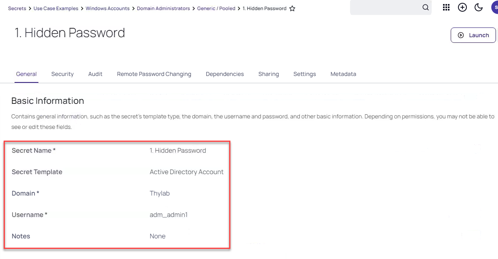

However, scroll down and you will find that there is an RDP Launcher available, which will allow you to connect via RDP to a target host using this account and the privileges associated with it. Click the RDP Launcher button..

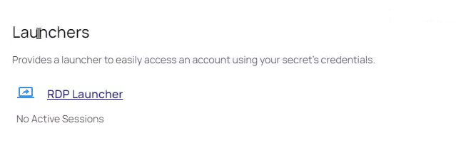

In the dialog box that is presented, enter "sspm.thylab.local" and hit launch now. A session will open in to the sspm server and you will be logged in as adm_admin1 by Secret Server. Nice, you've successfully completed your first privileged session launch!

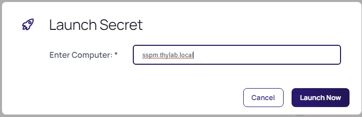
 
In the dialog box that is presented, enter "sspm.thylab.local" and hit launch now. A session will open in to the sspm server and you will be logged in as adm_admin1 by Secret Server. Nice, you've successfully completed your first privileged session launch!

---

**Note**

You will get some messagese from the Remote Desktop session as we are not using a certificate in the Demo Lab. Please click **Connect** till you have the desktop.

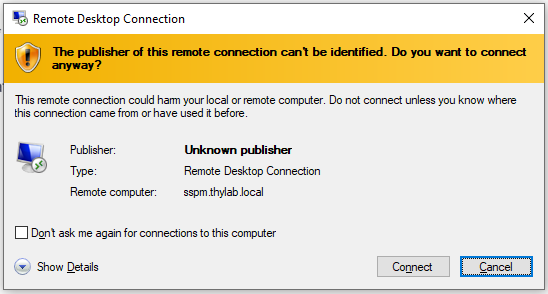

---

### Session Connector Launching
The basic RDP launch establishes an RDP connection from your client device to the target host/platform using the privileged credentials. However, there are cases when you may want to launch using an intermediary device - commonly referred to as a "jumphost". The jumphost in Secret Server is referred to as Session Connector.

Head to **Secrets >> > Windows Accounts > Domain Administrators > Generic/Pooled > 6. Session Connector (RDS Launching)**.

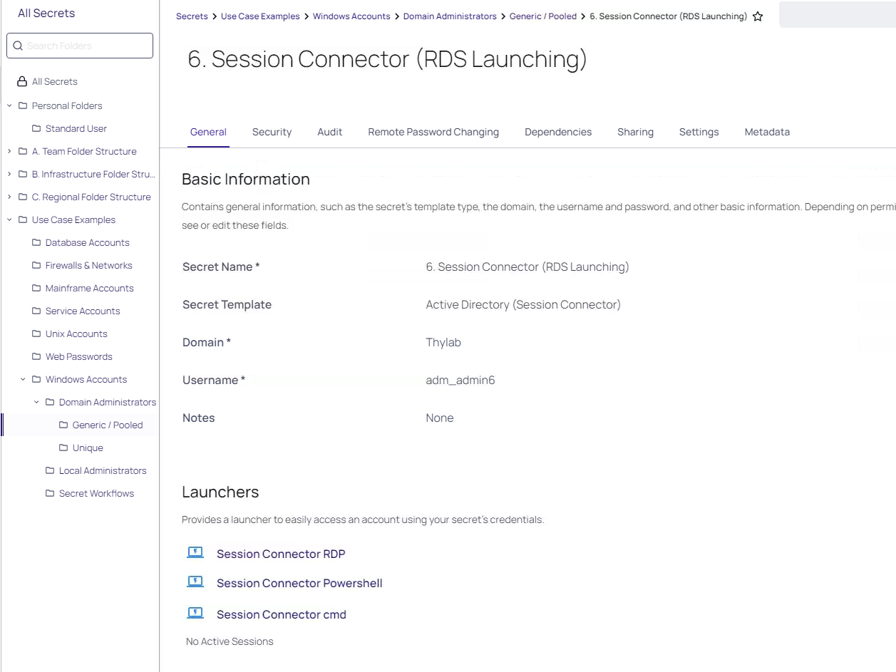

On this Secret you can see that we have a number of different launching options that look similar to the standard launching function, however the actual launch itself will be drive as a RemoteApp. This means that on your client it will look and feel the same as if you had done a direct RDP launch, however the actual application itself is actually running on the Session Connector host (it's a virtualized app). 
 
Go ahead and try launching the **Session Connector RDP** option and at the prompt enter "sspm.thylab.local". This will download a RDP file you can open. If you open this a new screen will appear and click **Connect** twice so the connection will be made to the SSPM.thylab.local server via the RDS01 (RDS server)

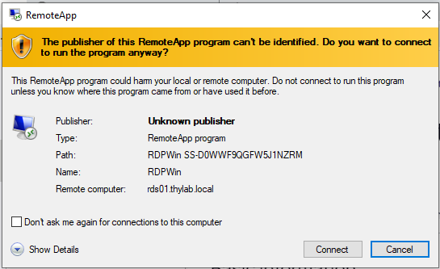

---

**Note**

TO see that the connection is not made directly from your client, on the SSPM, open a command line and type ``netstat -a | findstr 3389`` and see that the IP addresses mentioned are not showing the name, or IP address of the client (172.31.32.118). You do however see the RDS01 mentioned as that is the "jumpbox" for the connection

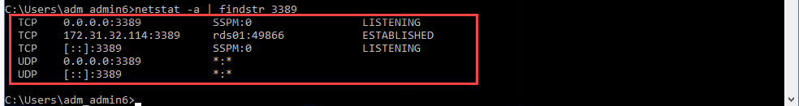

---

### Additional RDP Launching Options 

There are a multitude of different options available for RDP session launching that helps ensure that users are getting the correct privileged access at the correct time.

In the example below (**Secrets >> > Use Case Examples > Windows Accounts > Domain Administrators > Generic/Pooled > 2. Hidden Details**), almost all of the fields are hidden. This is to prevent data leakage - particularly in the case of third parties - but ensures that they can still utilize the privilege that they need to in performing their role.

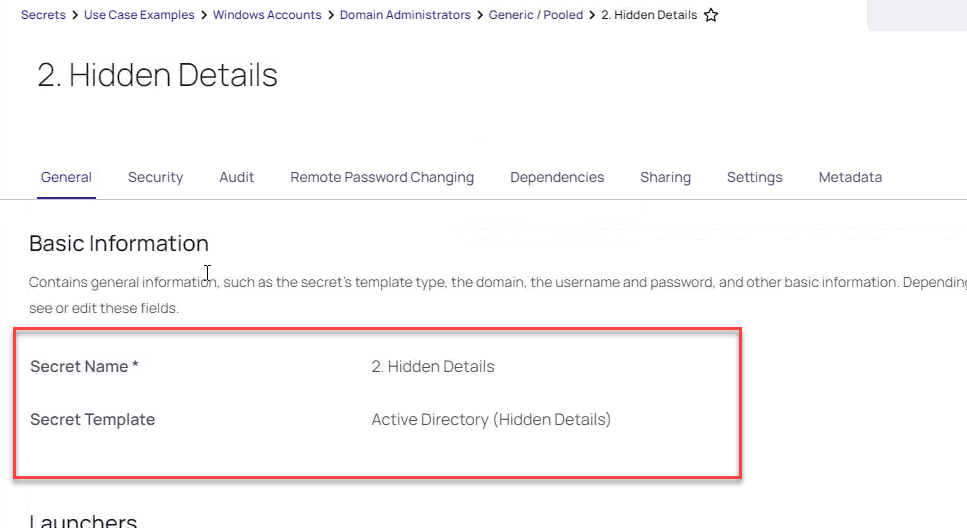

As well as having an open dialog box in to which the user can specify the device they wish to access, a device list can also be presented to the user that allows them to select where to launch to. Take a look at this in: **Secrets >> > Use Case Examples > Windows Accounts > Domain Administrators > Generic/Pooled > 3. Restricted Launch** and click the **RDP Launcher** to see an example of a restricted list of targets

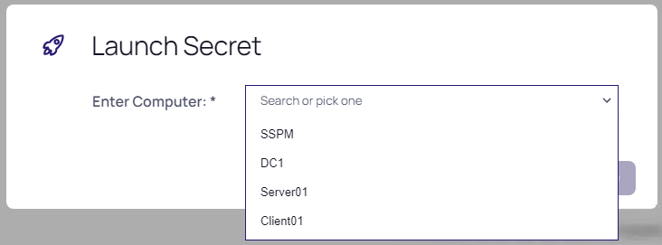

---

**Note** 

In some cases the device list is going to include a large number of items. If the list goes over 15 items, it stops displaying as a single list and becomes a searchable list, easing the user interaction with the tool.
 
---

Within each Secret there also exists a "Security" tab, under which you can easily - via checkboxes - make changes to the way in which the Secret is secured. For example, a comment can be required for use or session recording enabled. 

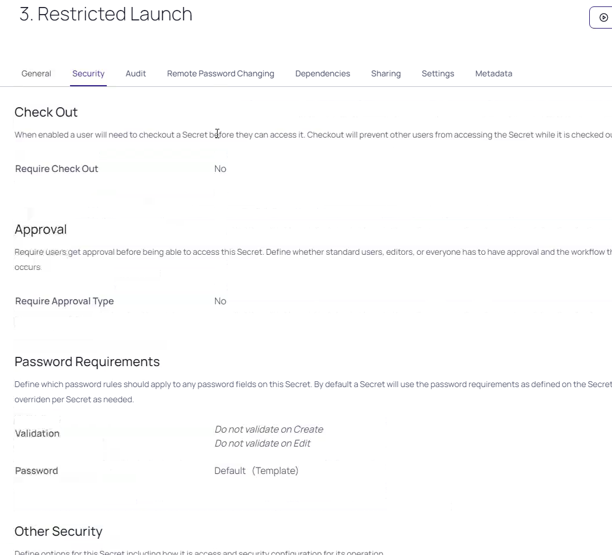

---

**Note**

These security options can also be set on a larger scale through the use of "Secret Policies". If you want to investigate these, log in as **ss_admin** and head to **Administration >> > Actions > Secret Policies**. Here you will be able to create a Secret Policy that either enforces or sets as default a particular security setting. Then, apply this Security Policy to a Folder (through the "**Edit Folder**" option). Give it a try, if you dare!

---

## SSH
Privilege launching in to SSH devices is achieved through an inbuilt version of PuTTY that can be easily accessed through the use of an out-of-the-box launcher. 

Head to **Secrets >> > Use Case Examples > Unix Accounts > 1. Unix Root Account - SSH Key**

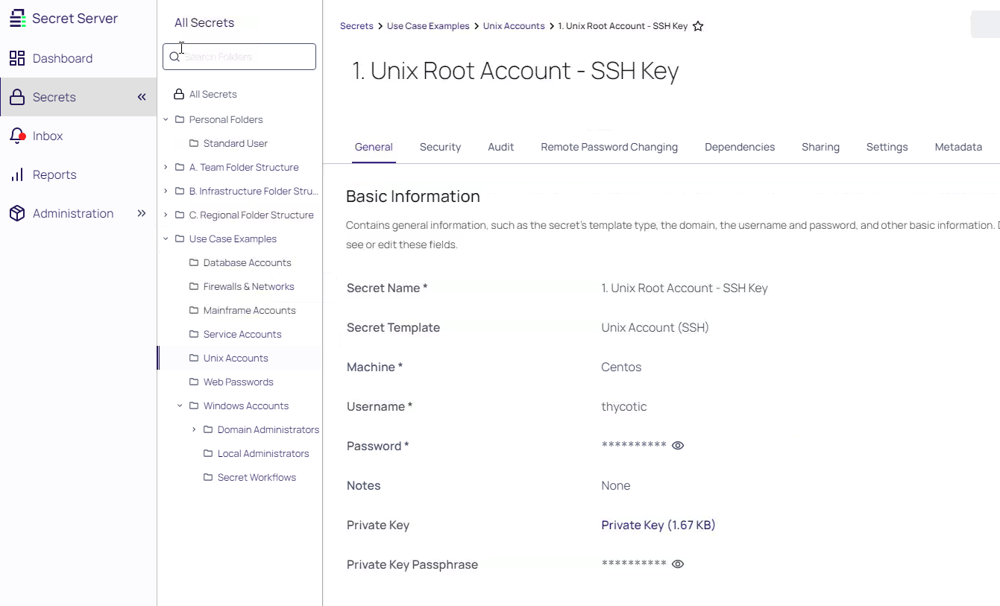

Here you will find an administrative credential for the CentOS Server that is in the lab. Scroll down and find the PuTTY Launcher.

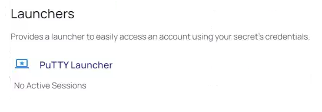

Once you click on the PuTTY Launcher button, PuTTY will open and you will have a privileged session for you established on the target device. Easy!

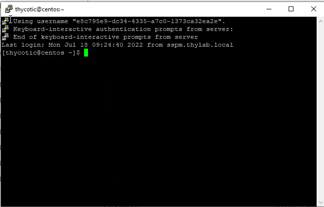

---

**Note**

Command controls (allow and block) can be implemented in the context of SSH sessions, such that you can manage user behavior within the device and ensure that users do what they should be doing. This function is not covered in this lab.

---

## Web

Web-based session launching is powered by the Secret Server browser extension (available for Google Chrome and Mozilla Firefox). This extension populates web credential entry screens on behalf of users so that they do not need to have the password ever exposed to them. The browser extension also handles web session recording for us.

---

**Note**

Note that the extension icon in the browser is dark blue. It is actually already logged in! When you open Secret Server and authenticate with the web console, if the browser extension is installed it will also be automatically logged in. This means that your users can immediately get privileged access without a separate logon.

---

Let's take a look at an example. Head to **Secrets >> > Use Case Examples > Firewalls & Networks > OpnSense Root Account**. 

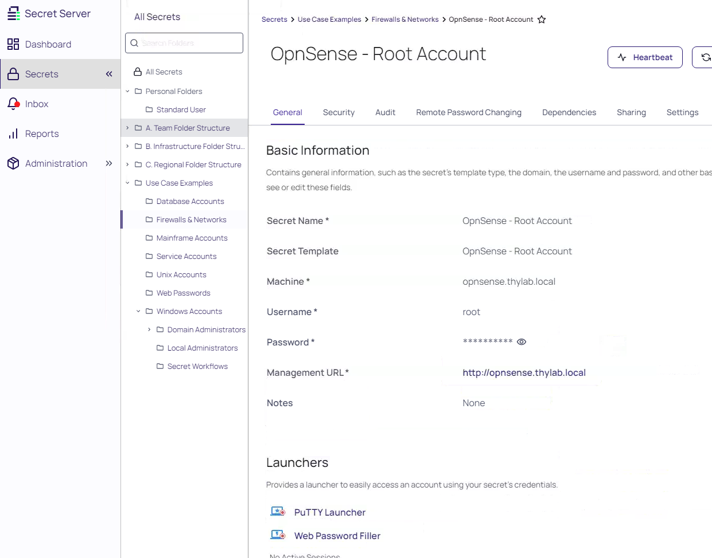

This Secret is interesting in the sense that it has multiple launchers attached to it that are substantially different. To administer this router, we might want to connect via the web administrative console, or via SSH. Both options are available for us:

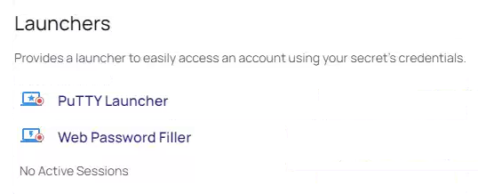

Click on the **Web Password Filter** and you will be presented with the web-based login screen for the router and an option to "Sign in as" the root user. 
You will now be notified that your web session will be recorded. Click **Login** and you will be presented with the administrative console for the device. 

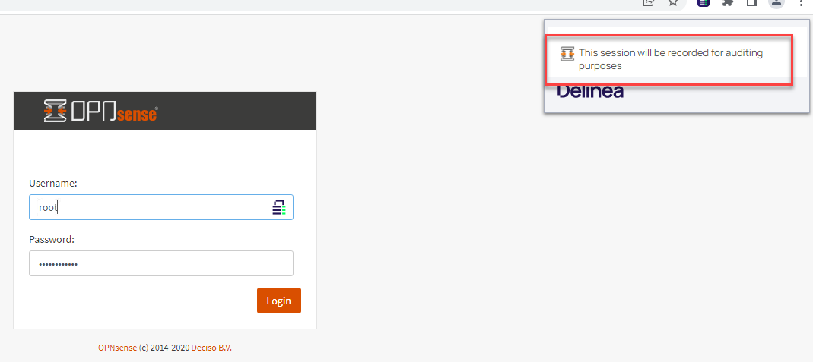

---

**Note**

Try using the PuTTY launcher as well - you'll be presented with the alternative SSH-based administrative console for the device. 

---

## Session Monitoring

Now that we have the capability to record user behavior as it relates to privileged access, we will also want a method via which we can review the actions of users during their sessions. 

Head to **Administration >> > Actions > Session Monitoring**

The standard session monitoring screen allows you to select the specifics of the session you would like to review. Clicking on the monitor button to the right will open that session recording panel.

Note the three icons below the recording itself - this will identify what elements of the session have been recorded: video, keystrokes and processes, or any combination of the three depending on the setup of the session recording.

---

**Note**

Command cross-searching is available. Therefore search terms that relate to applications, powershell, for example, can simply be searched for in the search dialog box. This will allow you to find appropriate sessions far more efficiently. Try ``netstat`` as a command to search for and see what happens

TIP: Session recordings can also be reference directly from within the Audit trail from individual Secrets, where required.

--- 

Opening a session recording that includes keystrokes and a video and you will have the keystrokes presented on the left hand side (searchable) and the video on the right. Note the colored bar beneath the session recording, this will display visually where there is action or movement in the session and allows you to skip easily and quickly to relevant parts of the session. Try clicking on it to move the session forward. Additionally, the two arrows will allow you to expand the session to full screen for a more detailed review of the activity. The "jump to" buttons also allow you to skip to relevant parts of the session.

## Reporting & Auditing

Detailed reports and auditing exist for all actions performed within the solution. Individual Secret audit trails, available within the Audits tab on each Secret.

 
50 out of the box reports that can be customized through the user of "filters" and can also be scheduled to be sent to groups of users. This includes:

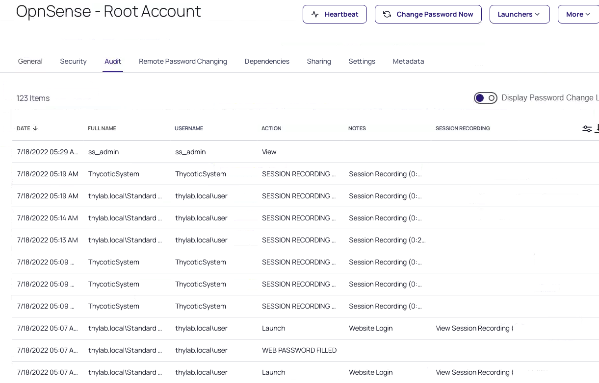

In order to "filter" a particular report by one of its pre-defined characteristics, press the Report Filter button and you will be given the option to select to delimit the report in the appropriate way. 

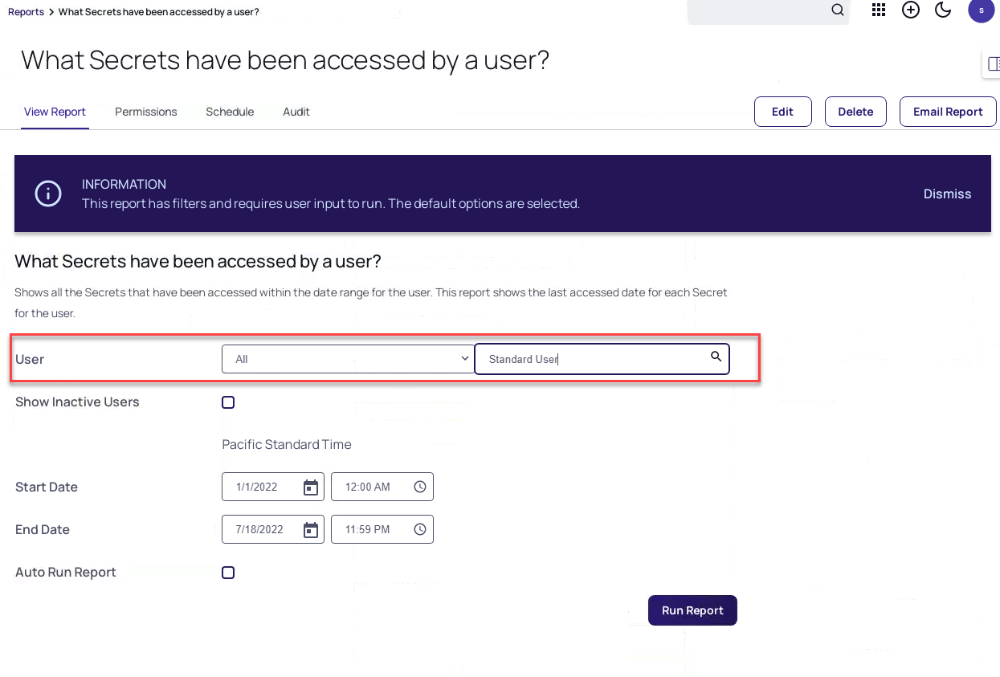
 
The User Audit (tab in Reports) feature is a especially good function when it comes to offboarding users from the solution. 

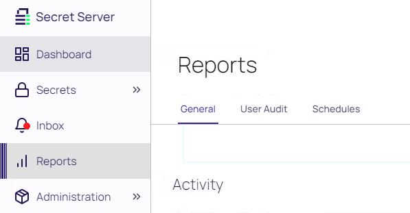 

By selecting a particular user and a date range in which they were part of the company, we can then get a listing of all of the Secrets (after clicking the **Search History** button) that they had access to during a particular time period. 

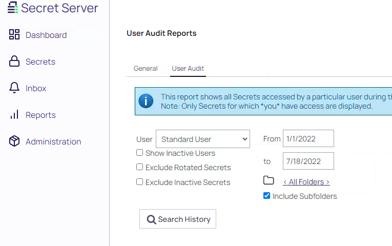 

From here, we can click on "Expire Now" and all of the Secrets they did have access to will now have their passwords changed, thus we can be confident that the offboarded user no longer has any access to our corporate resources.

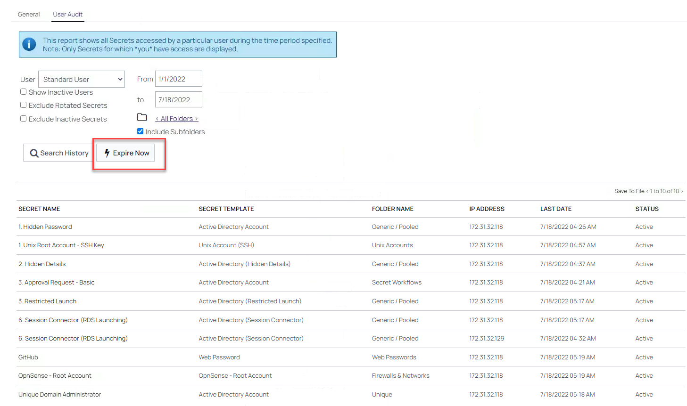 

---
**Note**

Fully customizable reports can be created in Secret Server through the use of SQL scripting. This means that if you don't see a report that you need, you can always create one either with help from Delinea or through your own SQL… the options for interesting reporting are thereby limitless! 

---

## SSH Terminal

When it comes to SSH launching, some users are going to want to use an existing SSH terminal/shell to access devices, and they, like all users, will need a way of getting access to privileged credentials. This is where SSH Terminal becomes handy.

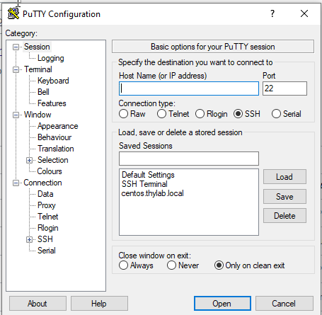 

Open the start menu and search for "PuTTY" and then launch it. You should be presented with the application with a saved connection for "SSH Terminal". Load it and then open it.

You'll be prompted to authenticate. Use **user** as the username and then insert the password for user using the SkyTap credential panel.  

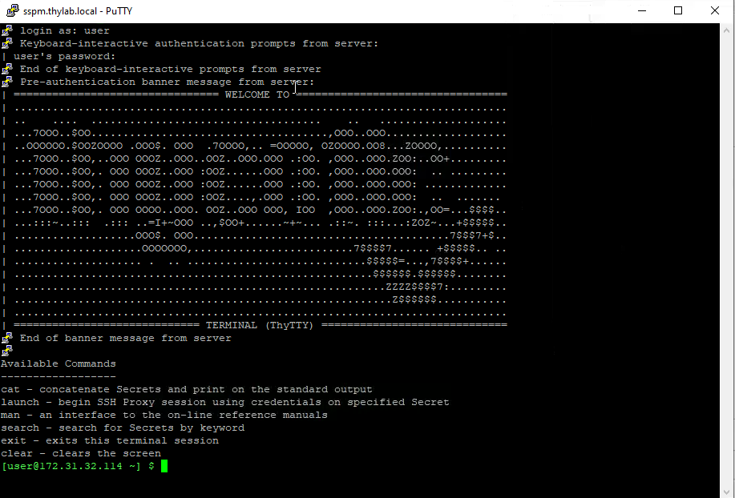 
 

Once successfully logged in, you will see a screen similar to the above. You are now logged in to the SSH Terminal itself and this will now allow you to "jump" to other shell sessions, right from the commandline.

Type the following command and you will be presented with a list of Secrets to which you have access within SSH Terminal:
``search``

From there, you can select to "launch" to Secrets based on their Unique Identifier, which is called their SecretID. This value is the most robust way of referring to individual Secrets. Let's pick a Secret and launch to it:
``launch 14``

Success!

We should now see a prompt such as follows:

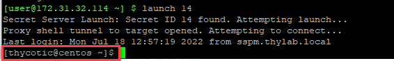 

If so, we are now authenticated as an administrator with an alternative device via SSH with a privileged credential. Note that we still don't know what it is (it's an SSH key). Nice.

To exit the session(s), type:
``exit``
``exit``

PuTTY should close and our privileged sessions for SSH are now ended.
