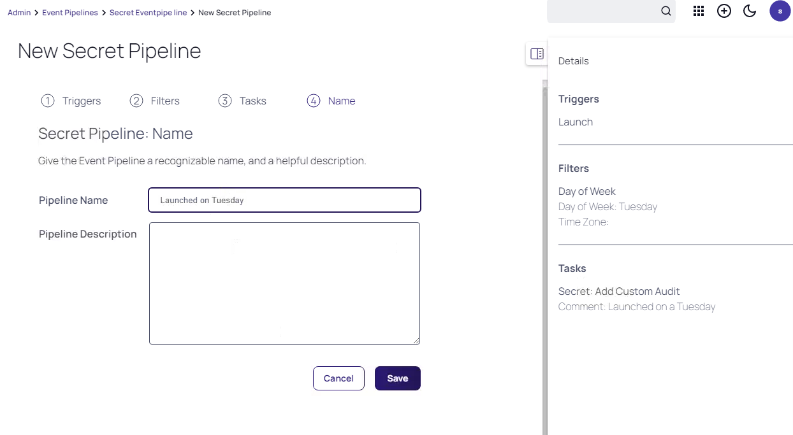

# Advanced Use Cases

## Discovery

Often times the number and extent of privileged accounts within the environment is going to be unknown. Thus, the solution has an inbuilt discovery methodology which will allow us to identify privileged accounts which exist but that are not currently known by the PAM solution, to then onboard them.

Log in as **ss_admin** into Secret Server and head to **Administration >> > Actions > Discovery**

 
You'll note that we have multiple discovery sources, in this case for Unix discovery as well as for Active Directory discovery. Click on **Discovery Network View** to be presented with the accounts that have already been collected through a previously run discovery.

You will note that the entire thylab.local domain can be expanded. Many account types can be discovered, from Active Directory accounts to Local Windows accounts, local SQL accounts, Oracle accounts, etc etc. These accounts, once discovered, can be manually onboarded in to the PAM solution using the Import function, or automatically onboarded using the "Create Rule" function. 

Take a look at these options and see if you can import a domain account!

## Service Account Dependencies

When it comes to privileged service accounts, it is not enough just to be managing the username and password combination. One must also manage the dependent services or applications that rely on this service account as well. These are referred to in Secret Server as dependencies and can be automatically onboarded. Let's take a look. Click the **Service Accounts** tab. Here we can see that there is an "Unmanaged" dependency for a service account on the RDS01 server. The fact that this has been discovered means that Secret Server has identified that it is a service, has identified that it owns the privileged account for this Secret (thylab\svc_service1), but that it does not have a listing for this particular dependency. Hence it is marked as "Unmanaged". 

Click on the checkbox to the left of RDS01 and then press **Import**. This will begin the process of importing this dependency against this particular Secret (ie service account). Click **OK** and the dependency will import. Click **Close** when done.

 
From there, head to **Secrets >> > Use Case Examples -> Service Accounts -> thylab\svc_service1** and then go to the **Dependencies** tab. And there you have it, our new dependency has now been added! 

You can see that the run result is a red i. This will be marked as green when the password for our service account changes the next time.

---

**Note**

If you really want to manually run the dependency now, click the checkbox on the left-hand side of the dependency and select **Run Selected Dependencies** and Secret Server will go out and make sure that this service is running with the correct credential after you clicked **OK** in the warning screen that appears if you select the run now. Magic!

Lots of different functions can be managed as a dependency. We can also build our own dependencies using scripting, depending on the external application that needs to be integrated. There's lots of fun possibilities here.

---

## Event Pipelines

Event Pipelines are the "if this, then that" engine in Secret Server, and allow us to automate some of the configuration of the solution with ease. 

While still logged in as **ss_admin** and head to **Administration >> > Actions > Event Pipeline Policy**

Event Pipelines consist of two overall configurations - Policies and Pipelines. Policies are essentially just containers for the pipelines that run within them and allow us to specify certain Folders to which the pipelines within should apply. 
 
Create a new policy with **Add Policy**. Give it an interesting name and set the Policy Type as Secret.

 
Press **Add Pipeline** and **Create New Pipeline**.

Click **Create**. Pipelines have within them a number of items:
1.	*Triggers*. This is what sets the pipeline to run. Triggers can be a large number of items but in our example above it is set as "Launch" which means that any Secret "Launch" action on our target Secrets will trigger this pipeline. Use the search option in the lower part of the middle screen and search for **Launch** then use the **+** sign to add the trigger, and click **Next**
2.	*Filters*. These allow us to filter out (or in) various groups, Secrets, or other items depending on what we are targeting with our pipeline. In the search search for **Day of the Week** and set the day to **Tuesday** in the next screen that appears after clicking on the **+** sign, and click **Next**
3.	*Tasks*. These are the actions that are taken by our pipeline once it is triggered. Add the task **Secret: Add Custom Audit** and click the **+** and provide some text, and click **Next**
4. Provide a name and click **Save**

---

**Note**

To provide a more concrete, although somewhat ridiculous, example of these items, witness the above pipeline. The trigger for the pipeline is Launch, hence any Secret that is launched within the Folder we are targeting with our policy triggers the pipeline. The pipeline then checks the day of the week. If it is Tuesday, the pipeline keeps running, if not, it stops. If it is Tuesday, it then runs its task which is to add a custom audit to the launched Secret which says "The Secret was launched on Tuesday." 

---

There are an enormous number of potential options for event pipeline implementation - experiment with it and see what you can come up with! 

## Custom Scripted Password Changer & API-based interaction

Secret Server features a fully functional REST API that can be used for retrieving (and altering) information within the solution.

Head to the **API Examples** folder on your Desktop and you will get access to two scripts. Right-click on the **Windows Authenticated API.ps1** file and click *Edit*. This will open the script in *Powershell ISE*. Click the *green play button* to run it. This will head to Secret Server and retrieve the password for Secret number 30 and display it in green. 

Let's take a look at the script in a little bit more detail. 

``$api = "https://sspm.thylab.local/secretserver/winauthwebservices/api/v1"``

This URL is the location of the Windows Authenticated REST API in Secret Server in this lab.

``$secretId = "30"``

This identifier is the SecretID, a unique integer value that is unique to every secret. Use this to lookup information from a specific Secret.

``$fieldvalue = "password"``

This is the field for which we want to retrieve the value. We could change this to "username" or any other field name upon the Secret we are trying to retrieve.

``$result = Invoke-RestMethod "$api/secrets/$secretid/fields/$fieldvalue" -UseDefaultCredentials``

This is the REST call to the Secret Server API. Note the use of "-UseDefaultCredentials". This means we are using the logged on domain user context to establish authentication with the API. OAUTH Bearer tokens can also be presented as authentication. For more information on this, see the full API documentation or speak to your Delinea liaison..

``Write-Host $result -ForegroundColor Green``

This line simply writes out the resultant retrieved Secret value, depending on what we have specified above.

--- 

**Note**

The **API Based Search.ps1** script is also available. Running this will allow you to use the script to search through the Secret Server API for search terms (currently it is set to **Opnsense**). This will then return details of the Secret found alongside their unique SecretIDs. Search for a term (to lookup the SecretID and secret name) and then take the SecretID you discover and put that in to the **$secretID** variable in the **Windows Authenticated API.ps1** script and run it to retrieve a new, different password. 

You can also find the SecretID of a Secret through the URL address bar:

A full REST API guide is available from within the tools menu in the  Secret Server UI via **Administration >> > Actions > REST API Guide**

---

## Administering RBAC

Ensuring that only the correct users have access to the correct Secrets is essential in configuring the PAM solution. Users have access that is determined by both their role and by their Folder and Secret Access. In both cases, unless explicitly defined, the user will not have access. 

### Roles

Roles can be customized on the basis of over 100 discrete role-based permissions. Head to **Administration >> > Users, Roles, Access > Roles**, click on **User** and click on the **Permissions** tab and click Add. Here you will be able to add individually permission assignments to the user role by dragging and dropping. 

Or drop the permissions by hoovering over the permission and click the **bin icon**

Users can be assigned to roles either individually or through group membership. In **Administration >> > User, Roles, Access Roles** click **Users** and take a look at which users and groups are assigned to each role. This can be fully customized, based on your organizational requirements.

### Folder and Secret Permissions

Access to Folders and the secrets within them can be fully customized by right-clicking on any folder and clicking Edit Folder. Note that permissions to the folder and the secrets within are independent permissions. The below screenshot has been made from the **Cloud Accounts** folder and the **Permissions** tab and clicking **Edit**

As noted above, access can be granted to groups (either internal to Secret Server or based on Active Directory Security Groups) or individual users. Folder permissions can either be Owner, Edit, View or List. Customize this to your liking. Secret Permissions can be set to Owner, Edit, View, List or None. The None permission means that users will be able to see the folder in the folder tree but not be able to see any of the Secrets within.

---

**Note**

If a user does not have access to a folder, it won't even appear for them in the folder tree, even if they have lots of administrative role permissions. The RBAC is designed to be enforced granularly to ensure that only the correct users have access to the correct permissions at the correct point in time. 

---