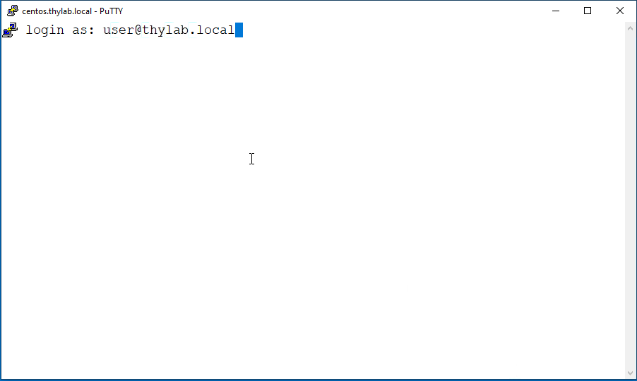
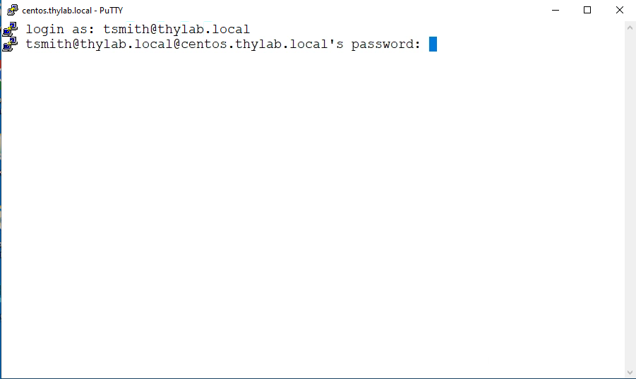
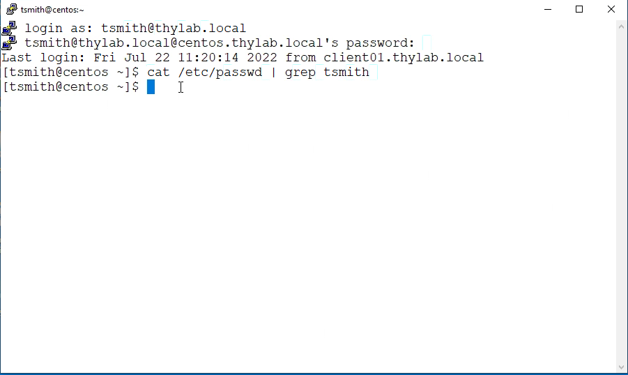
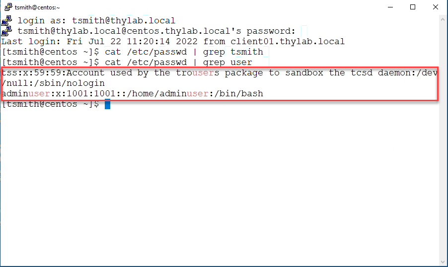

# Active Directory (AD) Bridging

## What is Active Directory Bridging?
At a basic level, Active Directory (AD) bridging enables non-Windows systems to be joined to AD. Doing this allows Active Directory benefits to be extended consistently across Windows, Linux, and UNIX IT systems and network devices.

One key benefit is allowing administrators to log in to non-Windows systems using their dedicated AD login credentials instead of a local privileged account such as root, ec2-user, or ubuntu. As part of an identity consolidation best practice, this helps reduce the attack surface by avoiding the proliferation of multiple local accounts across IT systems and ensures full accountability of privileged activities by preventing the use of these anonymous shared, privileged accounts.

More advanced AD bridging capabilities include supporting complex multi-forest AD architectures and trust models, a hierarchical model for cross-platform role-based access control, deep AD service integrations (e.g., Kerberos, AD-DNS, and AD-CS), extending AD group policy to non-Windows platforms, and Windows smart card login configuration extended to Linux systems.

## Environment description

In the environment there is a CentOS machine that has been prepared and is joined into the Active Directory (AD). As this is a demo environment we will not discuss what the steps have been to make this work. But it boils down to the following steps:
1. Install the Delinea Server PAM solution
2. Configure the installation to put a Linux machine under control of the software using an agent
3. Install the agent on the Linux machine
4. "Push" configurations

## Working with the CentOS machine

To show the AD integration, open Putty from the Start bar 

There will be a machine ready to be used (**centos.thylab.local**), double click on the machine and a SSH session will open 

---

**Note**

Make sure the machine is running. If it is not, start it. If you haven't touch the machine for more than 2 hours, it may have shutdown

---

### Using a SSO login

The agent that is installed on the Linux machine is capable of using the Kerberos ticket from the machine, on which the user is logged in. THis saves the password retyping. To make this work, type the username **user@thylab.local** in the Putty screen

As soon as you hit the **ENTER** key you will see that the system logs you in directly, without any retyping the password. This is due to the fact that you have already logged in to your WIndows machine. Log out of the ssh session.

---

**Note**

To log out of the SSH session use **CTRL+D** or type **exit**

---

### Using "normal" login

Besides the way of logging in using the Kerberos ticket, the agent also allows access using the username and its password as credentials. Open Putty again and double click the **centos.thylab.local**. Log in as **tsmith@thylab.local** and hit **ENTER** on your keyboard. You will be presented with the password to be filled out

Type **Delinea/4u** as the password and your logged in to the system. To check that the accounts user and tsmith don't exist on the system as local accounts, run ``cat /etc/passwd | grep tsmith`` and see that there is no line shown that has the words tsmith in them.

Do the same for the user account and see that there are two lines that show the user (in orange) but not just **user** as the account (first word in the two lines). The two lines should show **trousers** and **adminuser**

Log out of the session and try the above steps using the **state@thylab.local** account and see that that account, even though it exists in the AD, has no rights to login to the system (the system will allow 5 times before it closes the attempt). 

Close the Putty session as the last step of this module

## Conclusion

Using a relative simple process it is possible to make a Linux machine part of the AD where **allowed** users can login to Linux systems using their AD Credentials. All actions are now logged on their account and makes the accountability something easier to report on we will look at that later in the lab.

