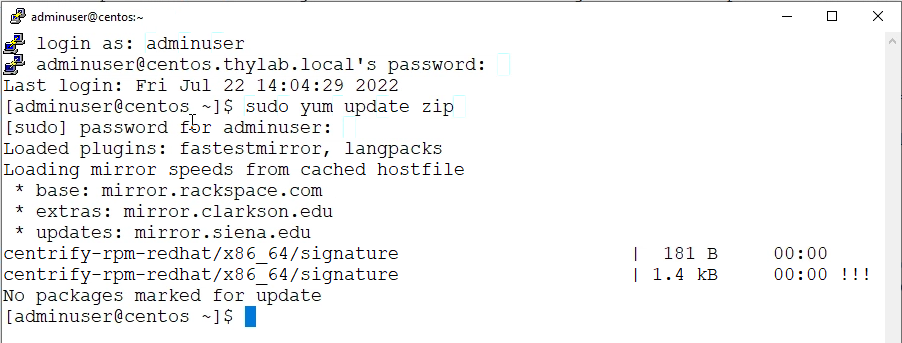
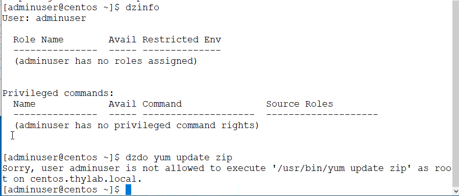
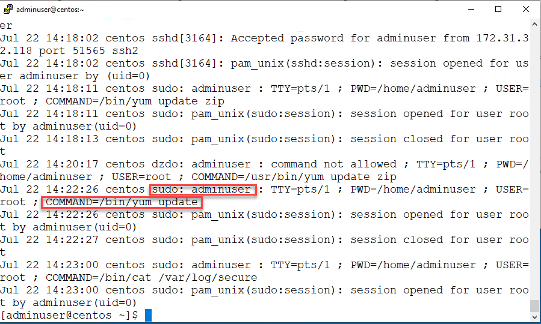
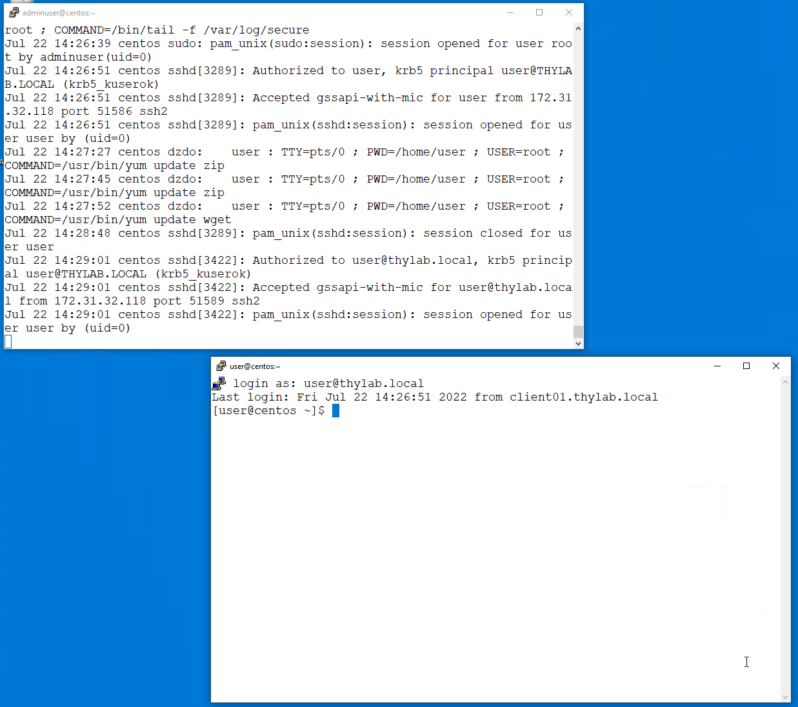
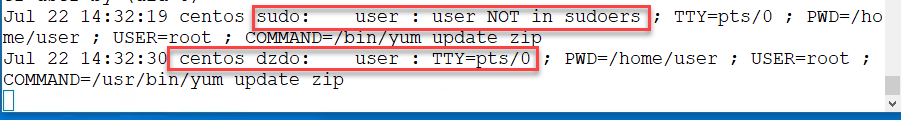
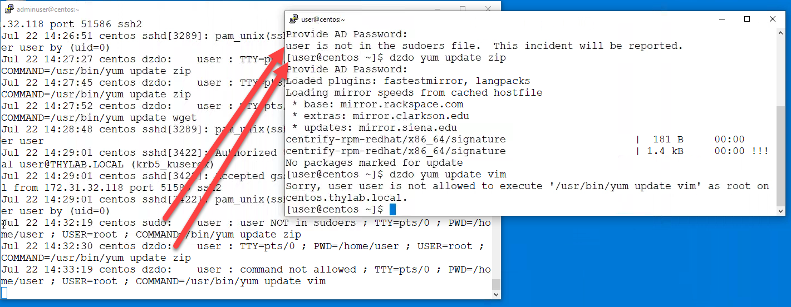
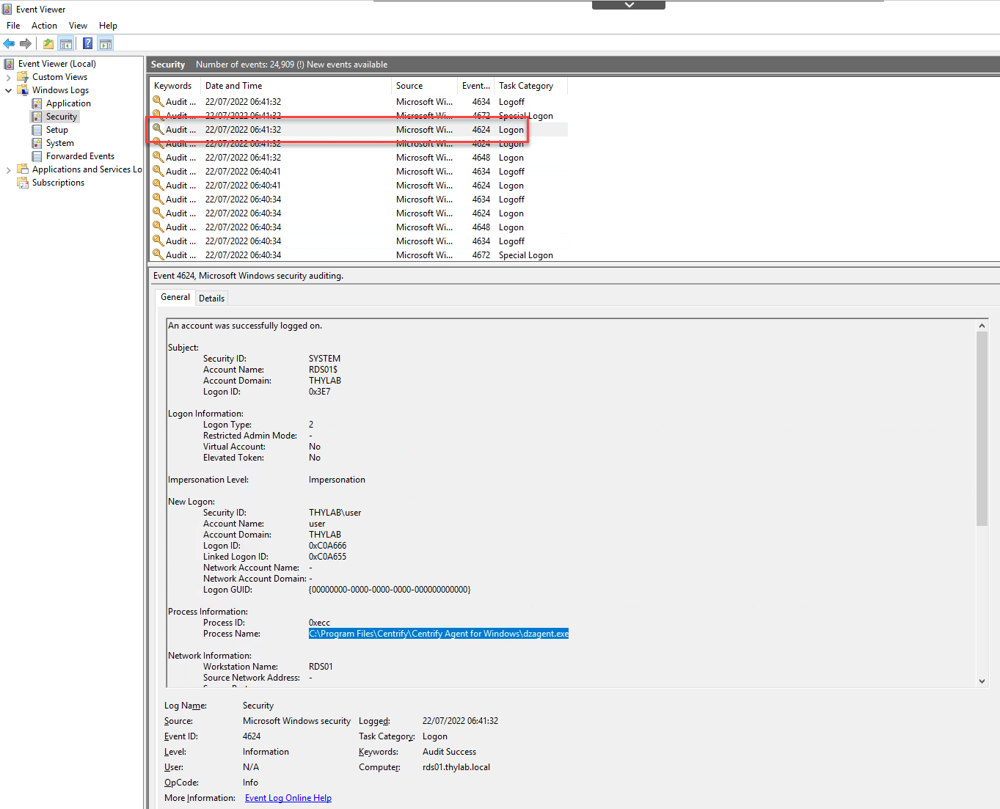
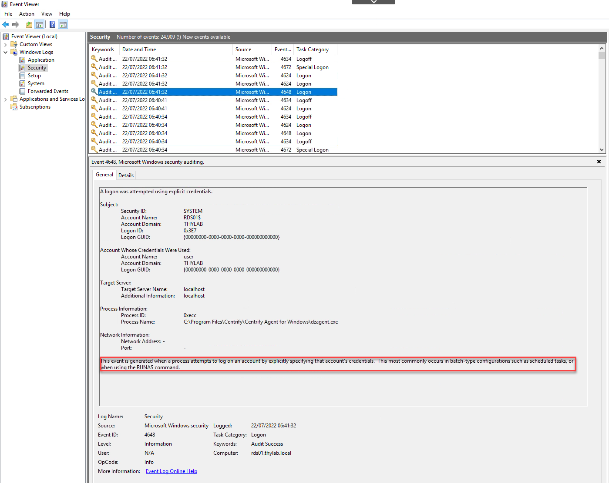

# Linux Security logs

As described in the JIT module of the lab, all actions will be logged in the system with respect to security (on CentOS Linux /var/log/secure). Using the sudo command, all commands that are run under the account, will be logged and shown in the log file. This gives the security and IT team the possibility to track who has run commands with elevated privileges.
A problem is that such an account, which is added to the */etc/sudoers* file, can run **ANY COMMAND** with the ``sudo`` commands by default. Limiting what can be run using the sudo command, is done by changing the file **/etc/sudoers**. It's going to be hard to maintain this file on 20+ Linux systems. To know more on this file, read [this document](https://kifarunix.com/run-only-specific-commands-with-sudo-in-linux/).

## Security logging on Linux

To show this security logging process, after getting onto the client machine, open the Putty sessions to CentOS.thylab.local and login as **adminuser** with the password **Delinea/4u**. This is a local account and has the rights to run the ``sudo`` command to get elevated rights. 
Run the command ``sudo yum update zip`` and see that after providing the password the command is executed

Problem is that even a command like ``sudo yum update`` is honored to be run. 

---

**Note**

**If you run this command, please cancel the action by typing "N" at the question, or be faced to possibly wait a 5 - 10 minutes as the system WILL update ALL packages**

---

Now try the dzinfo command and see that the account is "unknown" to the Server PAM solution (no roles assigned and no privileged command rights). So running ``dzdo yum update zip`` will have no effect. It will show an error.

Run the command ``sudo cat /var/log/secure`` and see that you can see the security log's content. There the action will be shown **sudo: <username that requested the privilege rights>** the command it ran

As mentioned in the other parts, this is not a wanted scenario. This is a possible big security gap! Run the command ``sudo tail -f /var/log/secure`` and open a new Putty session where you login as **user@thylab.local**. Position the two putty screen so that they don't overlap each other so you can see the secure log in realtime

Now run the following commands one after the other and see the log messages as they appear in the log file.
1. ``sudo yum update zip``; you have to provide the password of the user@thylab.local account, but will get an error that the account is not in the suoders file
1. ``dzdo yum update zip``; you will have to provide the password of the user@thylab.local account, and the command will be executed (as we have seen earlier this is one of the command that has been allowed by the system)
1. ``dzdo yum update vim``; as this command is not allowed by the system, there is nothing to be logged in the security log. The command is already blocked **BEFORE** execution

The last situation, a more controlled AND scalable configuration is what is recommended. This makes it possible to have *AS LITTLE AS POSSIBLE* local accounts on Linux machines so the attack surface can be reduced to a maximum. Only those accounts that should have access to the Linux machines will have access and can only run those commands they are allowed to run. An extra security layer can be added by requested an extra password authentication (as example).

Close all Putty sessions

## Security logging on Windows systems

For Windows Systems this will be logged in the Eventviewer. Open the console of the RDS01 and Right click the Eventviewer on the desktop and select **Run with Privileges...**. Open the security information and search for EventID **4624**. That event shows an Impersonation event and the program that has run the impersonation process (*C:\Program Files\Centrify\Centrify Agent for Windows\dzagent.exe*)

An Event with ID **4848** (RUNAS) is also shown, which is exactly what the system does when the **Run with Privilege...** is doing, as long as it has been allowed by the configuration.

  
<H1 style="color:#00FF59">THIS CONCLUDES THE LAB</H1>
